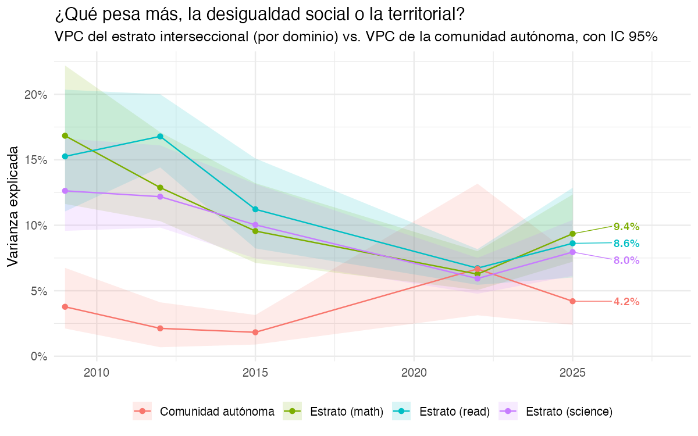
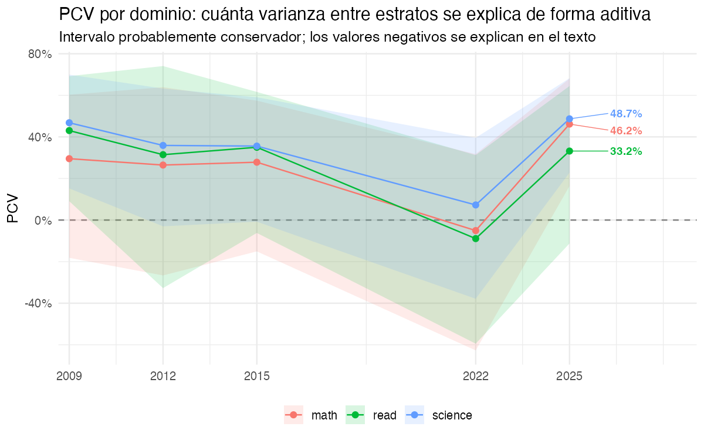
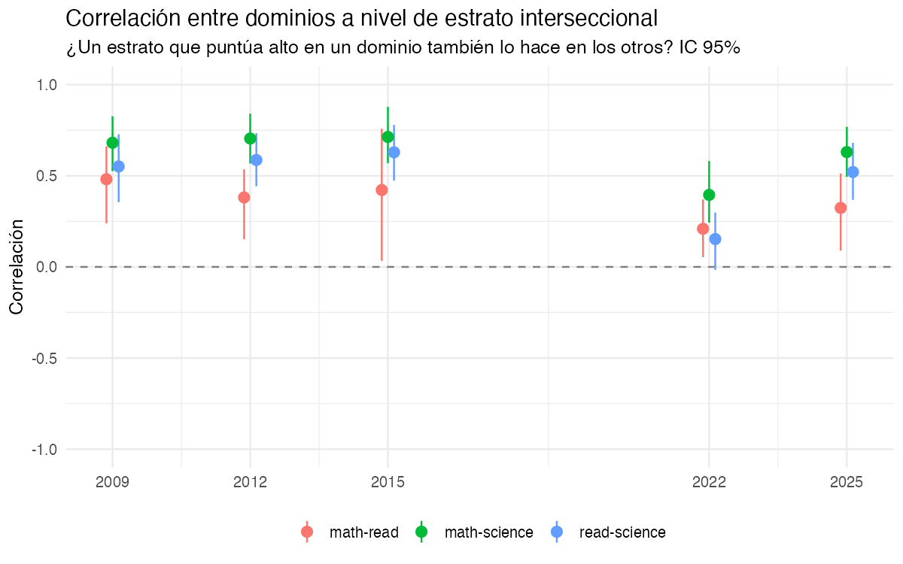
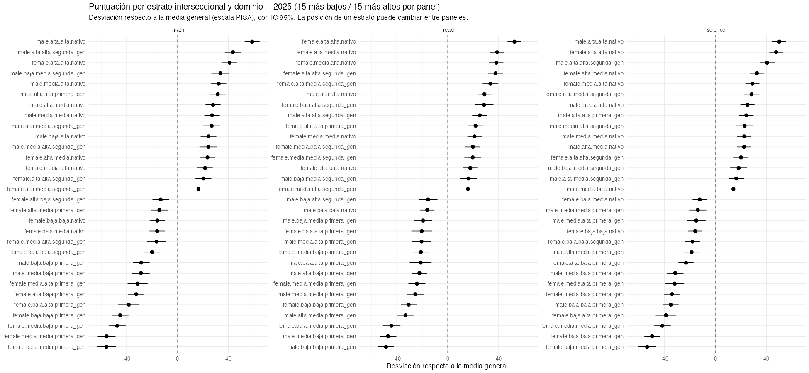
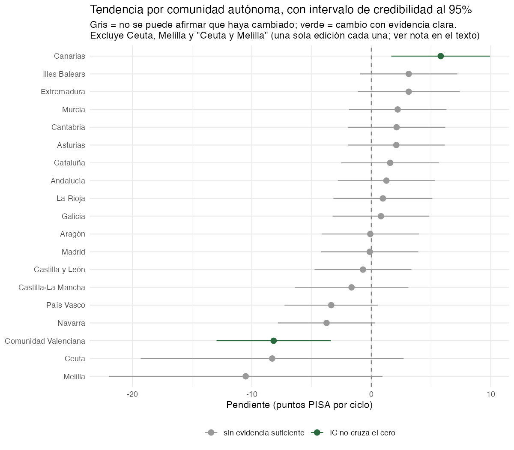
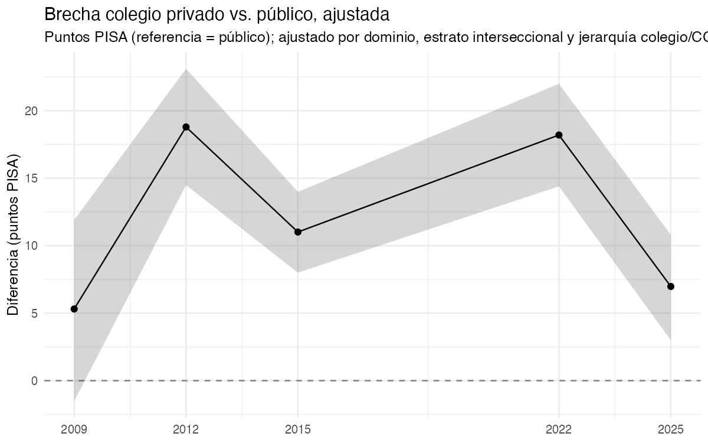
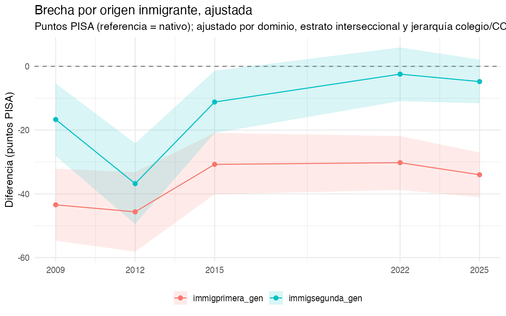

# Resultados

```{r}
#| label: setup-resultados
#| echo: false
#| message: false
library(dplyr)
library(gt)
library(scales)

vpc_compare    <- readRDS("../data/tbl_vpc_compare.rds")
vpc_pcv_strata <- readRDS("../data/tbl_vpc_pcv_strata.rds")
cor_strata     <- readRDS("../data/tbl_cor_strata.rds")
# PRUEBA DE VELOCIDAD (2026-09-14, ver R/03_model_maihda_ccaa_inla.R):
# colegio es `iid` simple mientras se prueba si esto resuelve la lentitud
# del ajuste -- vpc_school ya no tiene columna `domain` y no existe
# tbl_cor_school.rds.
vpc_school     <- readRDS("../data/tbl_vpc_school.rds")
strata_forest  <- readRDS("../data/tbl_strata_forest.rds")
slopes_full    <- readRDS("../data/tbl_slopes_ccaa_full.rds")
pubpriv        <- tryCatch(readRDS("../data/tbl_pubpriv_gap.rds"), error = function(e) NULL)
immig_gap      <- tryCatch(readRDS("../data/tbl_immig_gap.rds"), error = function(e) NULL)
puntuacion_ccaa_global <- tryCatch(readRDS("../data/tbl_puntuacion_ccaa_global.rds"), error = function(e) NULL)

# VPC/PCV del estrato es POR DOMINIO (modelo trivariante, ver
# qmd/03-metodos.qmd) -- se usa matemáticas como referencia para el texto
# narrativo; la tabla completa muestra los tres dominios.
latest_year <- max(vpc_pcv_strata$year)
latest <- vpc_pcv_strata |> filter(year == latest_year, domain == "math")
latest_ccaa <- vpc_compare |> filter(nivel == "Comunidad autónoma", year == latest_year)
latest_cor <- cor_strata |> filter(year == max(year))

# `has_trend` (añadido en R/05_communicate_uncertainty.R el 2026-09-16):
# Ceuta, Melilla y "Ceuta y Melilla" tienen datos de una única edición cada
# una (ver la nota larga en ese script y la de la sección 4 más abajo) --
# una pendiente no es estimable con un solo punto en el tiempo, así que se
# excluyen de las cifras "mejor/peor" y del forest plot. Fallback defensivo
# por si se lee una versión de la tabla generada antes de este cambio.
if (!"has_trend" %in% names(slopes_full)) slopes_full$has_trend <- TRUE
slopes_trend <- slopes_full |> filter(has_trend)
slopes_sin_trend <- slopes_full |> filter(!has_trend)

n_sig <- sum(slopes_trend$significant)
n_ccaa <- nrow(slopes_trend)
best  <- slopes_trend |> slice_max(slope_mean, n = 1)
worst <- slopes_trend |> slice_min(slope_mean, n = 1)
```

Este capítulo se genera a partir de las tablas y figuras que produce
`R/05_communicate_uncertainty.R`; el texto lee directamente los resultados
guardados, así que se actualiza solo al volver a ejecutar el pipeline.

## 1. ¿Pesa más la desigualdad social o la territorial?

::: {.callout-note}
## En términos sencillos, con un ejemplo

Imagina que separamos a todo el alumnado de PISA en grupos pequeños --
"estratos" -- combinando cuatro rasgos: género, nivel educativo de los
padres, nivel socioeconómico de la familia y origen migrante (nativo,
primera o segunda generación). Cada combinación posible de esos cuatro
rasgos define un grupo (72 grupos en total); algunos puntúan de media más
alto que otros.

- **VPC** (*Variance Partition Coefficient*): si solo supiéramos a qué
  grupo pertenece un alumno -- sin saber nada más de él --, ¿cuánto de la
  diferencia total entre todo el alumnado podríamos explicar? El VPC de la
  comunidad autónoma responde a la misma pregunta, pero sabiendo solo en
  qué región estudia, no a qué grupo pertenece. Comparar los dos números
  dice si pesa más el origen social del alumnado o el territorio en el que
  vive.
- **PCV** (*Proportional Change in Variance*): en vez de tratar cada grupo
  como una caja negra, ¿qué pasa si sumamos por separado el efecto de ser
  mujer, el de tener padres con estudios bajos, el de tener pocos recursos
  y el de ser inmigrante -- como una lista de la compra, sin dejar que se
  combinen entre sí? El PCV mide cuánto de la diferencia entre grupos queda
  ya explicada por esa simple suma. Si explica casi todo (PCV cercano al
  100%), el grupo no aporta información que no diera ya la suma de sus
  rasgos por separado. Si explica poco, es que la *combinación concreta* de
  esos rasgos importa más que cada uno por su cuenta -- la idea central del
  método MAIHDA. El PCV puede incluso salir **negativo**; qué significa eso
  se explica justo después de la Figura 2, más abajo.
:::

El estrato interseccional y el colegio son efectos trivariantes
correlacionados (uno por dominio, ver `qmd/03-metodos.qmd`), así que el VPC
y el PCV del estrato son por dominio; la CCAA se mantiene univariante. Como
referencia, en matemáticas y en `r latest_year`, el VPC del estrato
interseccional (género × educación parental × ESCS × origen inmigrante) es
**`r scales::percent(latest$vpc_mean, accuracy = 0.1)`**
(IC 95%: `r scales::percent(latest$vpc_lower, accuracy = 0.1)` –
`r scales::percent(latest$vpc_upper, accuracy = 0.1)`), frente a
**`r scales::percent(latest_ccaa$vpc_mean, accuracy = 0.1)`**
(`r scales::percent(latest_ccaa$vpc_lower, accuracy = 0.1)` –
`r scales::percent(latest_ccaa$vpc_upper, accuracy = 0.1)`) explicado por la
comunidad autónoma -- es decir, en `r latest_year` ambos niveles pesan de
forma comparable, con el estrato algo por delante. El PCV del estrato en
ese mismo dominio y edición es
**`r scales::percent(latest$pcv_mean, accuracy = 0.1)`**
(`r scales::percent(latest$pcv_lower, accuracy = 0.1)` –
`r scales::percent(latest$pcv_upper, accuracy = 0.1)`) -- un valor negativo,
que se explica en la nota tras la Figura 2. La tabla de abajo da los tres
dominios completos.

```{r}
#| label: fig-vpc-compare
#| fig-cap: "Desigualdad social (estrato, por dominio) vs. territorial (CCAA): VPC con IC 95%"
#| echo: false

```

**Cómo leer esta figura.** Las cuatro líneas convergen visualmente hacia
`r latest_year`: el VPC del estrato (una línea por dominio) desciende de
forma sostenida desde 2009, mientras que el de la CCAA se mantiene bajo y
estable hasta repuntar en la última edición. Con las cuatro bandas de
intervalo de credibilidad superpuestas en un mismo panel, la diferencia
exacta en `r latest_year` entre, por ejemplo, el estrato en matemáticas
(`r scales::percent(latest$vpc_mean, accuracy = 0.1)`) y la CCAA
(`r scales::percent(latest_ccaa$vpc_mean, accuracy = 0.1)`) -- poco más de
un punto y medio porcentual -- es difícil de estimar a simple vista sobre
un eje que llega a más del 40%; la etiqueta numérica junto al extremo
derecho de cada línea, y sobre todo las Tablas 1 y 2 más abajo, dan el
valor preciso.

```{r}
#| label: fig-pcv-strata
#| fig-cap: "PCV del estrato interseccional por edición y dominio"
#| echo: false

```

:::: {.callout-important}
## ¿Qué significa un PCV negativo?

**En una frase:** en `r latest_year`, el PCV del estrato en matemáticas es
**`r scales::percent(latest$pcv_mean, accuracy = 0.1)`** (IC 95%:
`r scales::percent(latest$pcv_lower, accuracy = 0.1)` a
`r scales::percent(latest$pcv_upper, accuracy = 0.1)`). Un valor negativo
**no tiene una lectura literal** -- no significa "más del 100% de
interacción" ni nada parecido. Lo correcto es leerlo como: *en esta
edición, sumar los cuatro rasgos por separado (la "lista de la compra" de
la nota de arriba) no aporta ninguna evidencia de que explique las
diferencias entre grupos*. El intervalo tan ancho, que cruza ampliamente el
cero, es parte del mismo mensaje: el dato es impreciso, no que la
interacción sea varias veces mayor que toda la variación posible.

::: {.callout-tip collapse="true"}
## Por qué puede pasar esto (detalle técnico, opcional)

El PCV compara la varianza entre grupos de dos modelos: uno que solo sabe a
qué grupo pertenece cada alumno, y otro que además añade, una por una, las
cuatro variables que definen esos grupos -- género, educación parental,
nivel socioeconómico y origen migrante. Lo normal es que esa segunda
varianza sea menor que la primera (de ahí que el PCV suela ir de 0% a
100%). Que sea *mayor* en vez de menor -- lo que produce un PCV negativo --
es un resultado conocido en modelos de este tipo cuando una de las cuatro
variables -- aquí, el origen migrante -- se incluye a la vez como parte de
la definición del grupo **y** como variable suelta en el segundo modelo
(algo que aquí se hace a propósito, para que el PCV no le atribuya al
grupo en su conjunto lo que en realidad se debe solo al origen migrante;
ver el comentario junto a `covars` en `R/03_model_maihda_ccaa_inla.R`). Esa
duplicación hace que ambas piezas del modelo compitan por explicar la misma
señal, y esa competencia puede hacer que la varianza estimada suba en vez
de bajar -- a diferencia de un R² de regresión lineal, la varianza de un
efecto de grupo en este tipo de modelo bayesiano no está obligada a bajar
de forma monótona según se añaden variables.
:::
::::

```{r}
#| label: tbl-vpc-pcv-strata
#| tbl-cap: "VPC del estrato (por dominio) y PCV por edición, con IC 95%"
#| echo: false
vpc_pcv_strata |>
  arrange(year, domain) |>
  transmute(
    Edición = year,
    Dominio = domain,
    `VPC estrato` = paste0(scales::percent(vpc_mean, accuracy = 0.1), " (",
                            scales::percent(vpc_lower, accuracy = 0.1), " – ",
                            scales::percent(vpc_upper, accuracy = 0.1), ")"),
    `PCV estrato` = paste0(scales::percent(pcv_mean, accuracy = 0.1), " (",
                            scales::percent(pcv_lower, accuracy = 0.1), " – ",
                            scales::percent(pcv_upper, accuracy = 0.1), ")")
  ) |>
  gt() |>
  tab_header(title = "Varianza social (estrato) a lo largo del tiempo, por dominio")
```

```{r}
#| label: tbl-vpc-ccaa
#| tbl-cap: "VPC de la comunidad autónoma por edición, con IC 95%"
#| echo: false
vpc_compare |>
  filter(nivel == "Comunidad autónoma") |>
  transmute(
    Edición = year,
    `VPC comunidad autónoma` = paste0(scales::percent(vpc_mean, accuracy = 0.1), " (",
                                       scales::percent(vpc_lower, accuracy = 0.1), " – ",
                                       scales::percent(vpc_upper, accuracy = 0.1), ")")
  ) |>
  gt() |>
  tab_header(title = "Varianza territorial a lo largo del tiempo")
```

**Qué mirar aquí**: si el VPC de la CCAA es sistemáticamente menor que el
del estrato interseccional (en cualquiera de los tres dominios), la lectura
directa es que, en España, importa más *quién eres* (tu combinación de
género, educación parental, ESCS y origen inmigrante) que *dónde vives* --
una conclusión que rara vez aparece así de explícita en el debate sobre
"ranking de comunidades autónomas". Si el VPC de la CCAA aumenta a lo largo
de las ediciones mientras el del estrato se mantiene, eso indicaría una
desigualdad territorial creciente que merece más atención de la que suele
recibir. Nuevo respecto a un modelo univariante: comparar el VPC del
estrato **entre dominios** -- si la desigualdad social pesa más en mates
que en lectura, por ejemplo.

## 2. ¿Un estrato o un colegio desigual en un dominio lo es también en los otros?

En `r latest_cor$year[1]`, la correlación entre dominios a nivel de estrato
interseccional es:
`r paste(sprintf("**%s**: %.2f (IC %.2f – %.2f)", latest_cor$par, latest_cor$cor_mean, latest_cor$cor_lower, latest_cor$cor_upper), collapse = "; ")`.

```{r}
#| label: fig-cor-strata
#| fig-cap: "Correlación entre dominios a nivel de estrato interseccional, con IC 95%"
#| echo: false

```

**Nota temporal (2026-09-14)**: mientras se prueba una configuración más
rápida del ajuste (ver `R/03_model_maihda_ccaa_inla.R`), el efecto de
**colegio** está simplificado a `iid` compartido entre los tres dominios --
por eso de momento no hay una correlación entre dominios a nivel de colegio
que mostrar aquí (solo la de estrato, arriba). El nivel estrato conserva la
estructura trivariante completa sin cambios.

**Qué mirar aquí**: una correlación alta y con intervalo lejos de cero
indica que la desigualdad interseccional es sobre todo una característica
general del estrato (quien puntúa bajo en un dominio tiende a puntuar bajo
en los demás); una correlación baja o incierta indica que el patrón varía
sustancialmente entre materias.

## 3. Qué estratos puntúan más alto y más bajo, por dominio

```{r}
#| label: fig-strata-forest
#| fig-cap: "Puntuación media por estrato interseccional y dominio (edición más reciente), con IC 95%"
#| echo: false

```

```{r}
#| label: tbl-strata-forest
#| tbl-cap: "Estratos con puntuación más alta y más baja, edición más reciente, por dominio"
#| echo: false
strata_forest |>
  arrange(domain, estimate) |>
  transmute(
    Dominio = domain,
    Estrato = strata,
    Desviación = round(estimate, 1),
    `IC 95%` = paste0(round(lower, 1), " – ", round(upper, 1))
  ) |>
  gt(groupname_col = "Dominio") |>
  tab_header(title = "Estratos interseccionales, ordenados de menor a mayor puntuación, por dominio")
```

**Qué mirar aquí**: a diferencia del proyecto internacional, aquí los
estratos incluyen origen inmigrante como cuarta dimensión (72 combinaciones
posibles), y ahora hay un panel por dominio. Vale la pena comprobar si los
estratos en el extremo bajo comparten la categoría de origen inmigrante con
independencia de género o educación parental -- eso apuntaría a que esa
dimensión domina el resultado más que las interacciones entre las cuatro --
y si un mismo estrato aparece en el extremo bajo en los tres paneles o solo
en uno (la sección 2 cuantifica esto de forma agregada vía la correlación
entre dominios).

## 4. Tendencia por comunidad autónoma

::: {.callout-warning}
## Ceuta y Melilla: por qué no aparecen con una "tendencia"

Ceuta y Melilla no tienen una serie temporal continua en los microdatos del
INEE: en 2009 se registran como una única categoría combinada, **"Ceuta y
Melilla"**; en 2012 y 2015 no hay datos de ninguna de las dos; y solo en
2022 aparecen ya separadas, como **"Ceuta"** y **"Melilla"**. El resultado
es que cada una de esas tres etiquetas tiene datos de **una sola edición**
-- y una tendencia (una pendiente en el tiempo) no puede calcularse con un
único punto temporal. Si se fuerza igualmente el cálculo, lo que sale es un
artefacto del modelo (no un cambio real), y puede salir muy grande y en
cualquier dirección -- de ahí que, en una versión anterior de esta figura,
"Ceuta y Melilla" apareciera con la subida más pronunciada de todas y
"Ceuta" con la bajada más pronunciada, cuando en realidad se trata del
mismo territorio partido en dos etiquetas sin solapamiento temporal.

Por eso estas tres filas se excluyen del gráfico y de las cifras
"mejor/peor" de más abajo. En su lugar, la tabla siguiente da su puntuación
media bruta (sin ajustar) en la única edición disponible de cada una,
para no perder el dato del todo:

```{r}
#| label: tbl-ceuta-melilla
#| tbl-cap: "Ceuta y Melilla: puntuación media en su única edición disponible (sin ajustar, no comparable a una tendencia)"
#| echo: false
#| eval: !expr "!is.null(puntuacion_ccaa_global)"
puntuacion_ccaa_global |>
  filter(ccaa %in% c("Ceuta", "Melilla", "Ceuta y Melilla")) |>
  transmute(
    `Comunidad autónoma` = ccaa,
    Edición = year,
    `Puntuación media` = round(media, 1),
    `IC 95%` = paste0(round(ci_low, 1), " – ", round(ci_high, 1)),
    N = n
  ) |>
  arrange(Edición, `Comunidad autónoma`) |>
  gt() |>
  tab_header(title = "Ceuta y Melilla, fuera del análisis de tendencia")
```
:::

De `r n_ccaa` comunidades autónomas con al menos dos ediciones de datos
(las únicas para las que una tendencia es estimable), **`r n_sig`**
(`r scales::percent(n_sig / n_ccaa, accuracy = 1)`) tienen una pendiente cuyo
intervalo de credibilidad al 95% no cruza el cero. La de pendiente más alta
es **`r best$ccaa`** (`r round(best$slope_mean, 1)` puntos/ciclo, IC
`r round(best$slope_lower, 1)` – `r round(best$slope_upper, 1)`); la de
pendiente más baja, **`r worst$ccaa`** (`r round(worst$slope_mean, 1)`
puntos/ciclo, IC `r round(worst$slope_lower, 1)` –
`r round(worst$slope_upper, 1)`).

```{r}
#| label: fig-slopes-ccaa
#| fig-cap: "Tendencia por comunidad autónoma, con intervalo de credibilidad al 95% (excluye Ceuta, Melilla y \"Ceuta y Melilla\"; ver nota arriba)"
#| echo: false

```

```{r}
#| label: tbl-slopes-ccaa
#| tbl-cap: "Pendiente por comunidad autónoma, ordenada de menor a mayor (excluye Ceuta, Melilla y \"Ceuta y Melilla\")"
#| echo: false
slopes_trend |>
  arrange(slope_mean) |>
  transmute(
    `Comunidad autónoma` = ccaa,
    `Pendiente (pts/ciclo)` = round(slope_mean, 1),
    `IC 95%` = paste0(round(slope_lower, 1), " – ", round(slope_upper, 1)),
    `IC excluye 0` = ifelse(significant, "Sí", "No")
  ) |>
  gt() |>
  tab_header(title = "Tendencia por CCAA")
```

**Qué mirar aquí**: como se advierte en `R/04_model_trend_ccaa_inla.R`, la
cobertura regional desbalanceada antes de 2015 amplía el intervalo de las
comunidades con menos ediciones -- una comunidad marcada "No" en la columna
`IC excluye 0` puede deberse a eso, no necesariamente a estabilidad real
(distinto del caso de Ceuta/Melilla de arriba, donde directamente no hay
tendencia que estimar). Conviene mirar el ancho del intervalo, no solo si
cruza el cero.

## 5. Brechas ajustadas: público-privado y origen inmigrante

```{r}
#| label: fig-pubpriv-gap
#| fig-cap: "Brecha ajustada colegio privado vs. público, con IC 95%"
#| echo: false
#| eval: !expr "!is.null(pubpriv)"

```

```{r}
#| label: fig-immig-gap
#| fig-cap: "Brecha ajustada por origen inmigrante, con IC 95%"
#| echo: false
#| eval: !expr "!is.null(immig_gap)"

```

**Qué mirar aquí**: ambas brechas ya están ajustadas por estrato
interseccional (que en este proyecto ya incluye origen inmigrante como
dimensión) y por la jerarquía colegio/CCAA -- así que la brecha de origen
inmigrante que se muestra aquí es la que persiste una vez tenida en cuenta
su interacción con género, educación parental y ESCS, no el efecto bruto sin
ajustar. Comparar esta cifra con la posición de los estratos con alumnado
inmigrante en @fig-strata-forest ayuda a distinguir cuánta de la brecha
bruta observada es composicional (viene de otras variables correlacionadas)
frente a lo que persiste tras el ajuste.

## Discusión: qué añade la mirada territorial

- **Territorio vs. estrato, no territorio en vez de estrato.** El resultado
  central de este proyecto (sección 1) no es "las CCAA son iguales" ni "las
  CCAA son el factor principal" -- es una comparación cuantitativa, con
  intervalos, de cuánto pesa cada una. Reportar solo el ranking de medias
  por comunidad autónoma (como suele hacer la prensa) oculta esta
  comparación.
- **La cobertura regional desbalanceada limita las ediciones más antiguas.**
  Antes de 2015 no todas las comunidades participaban con muestra ampliada;
  cualquier lectura de tendencia larga debe declarar este límite
  explícitamente, no solo mostrarlo implícitamente vía intervalos anchos.
- **El PCV del estrato hereda el mismo caveat que en el proyecto
  internacional**: el intervalo comparando modelo nulo y modelo principal
  probablemente sobrestima su anchura (ver comentario en
  `R/03_model_maihda_ccaa_inla.R`), así que conviene leerlo como
  conservador.
- **Las brechas público-privado e inmigrante son ajustadas, no causales.**
  Ambas controlan por composición observable (estrato, jerarquía
  colegio/CCAA) pero no eliminan la selección no observada de familias y
  alumnado hacia un tipo de colegio o entre territorios.
