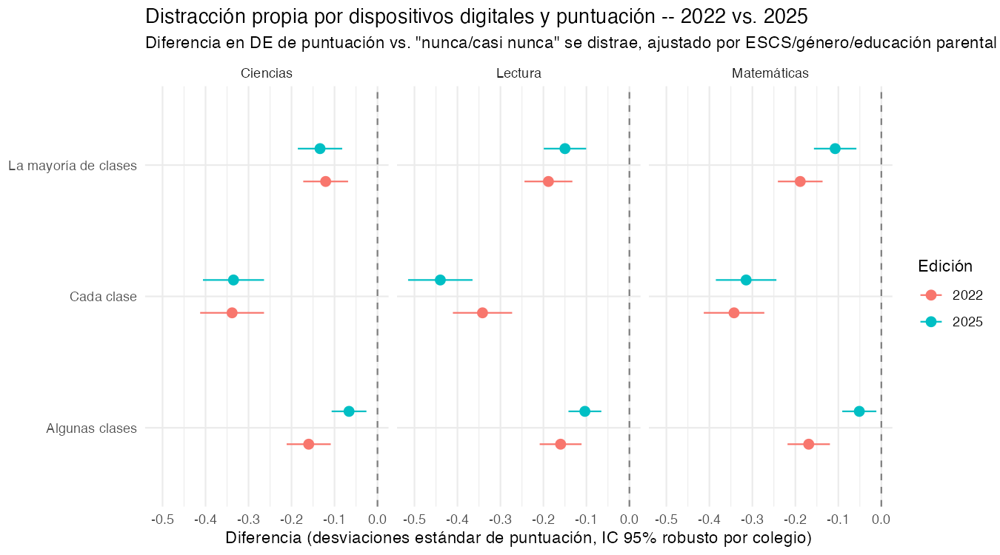
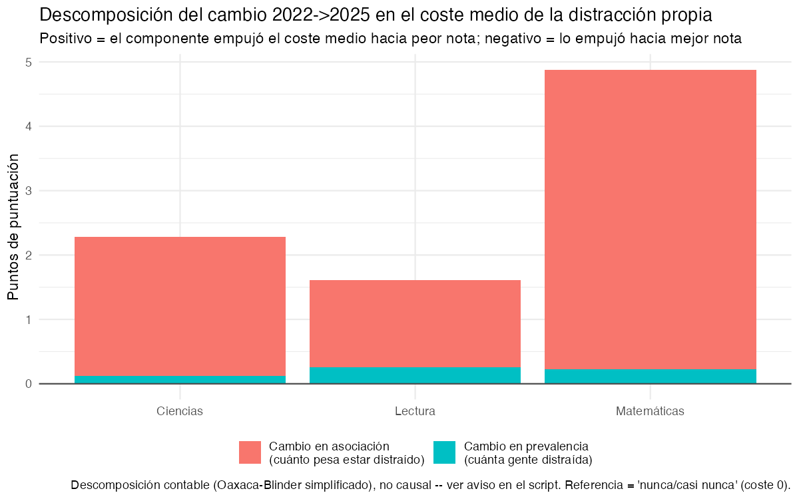
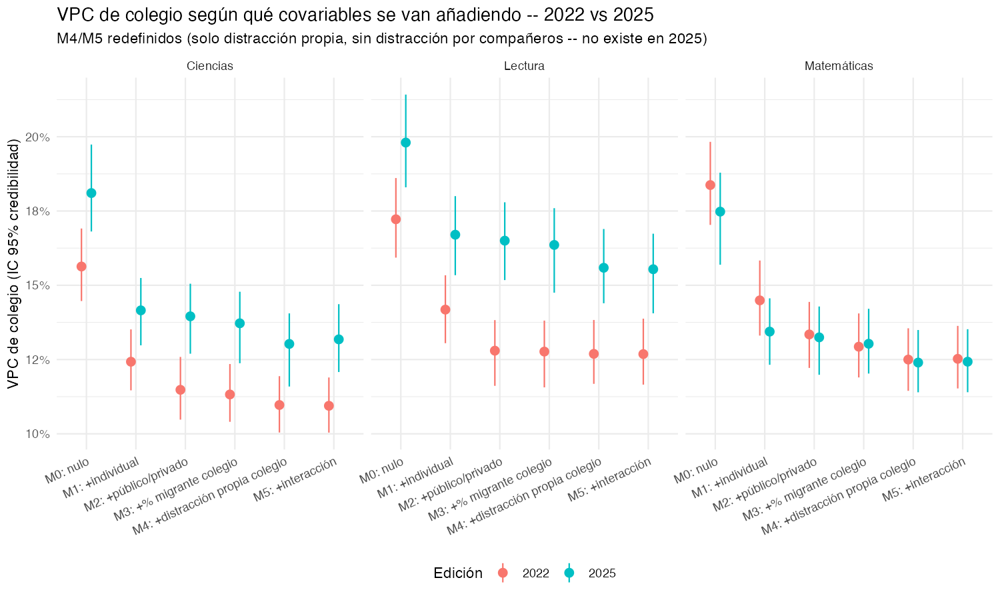

# Descriptivo: heterogeneidad, segregación y distractores digitales

```{r}
#| label: setup-heterogeneidad
#| echo: false
#| message: false
library(dplyr)
library(tidyr)
library(gt)
library(scales)

seg_nacional   <- readRDS("../data/tbl_segregacion_nacional.rds")
seg_ccaa       <- readRDS("../data/tbl_segregacion_ccaa.rds")
pubpriv_gap    <- readRDS("../data/tbl_brecha_pubpriv_migrante.rds")
exp_nacional   <- readRDS("../data/tbl_exposicion_digital_nacional.rds")
asociacion_22  <- readRDS("../data/tbl_asociacion_distraccion_2022.rds")

# Añadidas 2026-09-16 (ampliación del capítulo: distribuciones/DE en
# puntos, tendencia por CCAA, univariante de migración, modelo mixto con
# covariables de colegio):
puntuacion_migracion <- readRDS("../data/tbl_puntuacion_migracion.rds")
brecha_migracion     <- readRDS("../data/tbl_brecha_migracion_puntuacion.rds")
puntuacion_ccaa      <- readRDS("../data/tbl_puntuacion_ccaa_global.rds")
cambio_ccaa          <- readRDS("../data/tbl_cambio_ccaa.rds")
escala_puntos        <- readRDS("../data/tbl_escala_de_puntos.rds")
vpc_escuela_cov      <- readRDS("../data/tbl_vpc_escuela_covariables.rds")
interaccion_migra    <- readRDS("../data/tbl_interaccion_immig_segregacion.rds")
# Añadida 2026-09-21 (público/privado como bloque propio del modelo mixto,
# M2, a petición de Julián -- ver R/09_modelo_covariables_colegio.R):
pubpriv_efecto       <- readRDS("../data/tbl_pubpriv_efecto_colegio.rds")

# Añadidas 2026-09-21 (comparación 2022 vs 2025 en distractores, a petición
# de Julián -- ver R/06_exposicion_digital.R piezas (C) y (D)):
asociacion_22_25 <- tryCatch(readRDS("../data/tbl_asociacion_distraccion_2022_2025.rds"), error = function(e) NULL)
prevalencia_22_25 <- tryCatch(readRDS("../data/tbl_prevalencia_distraccion_2022_2025.rds"), error = function(e) NULL)
balance_22_25 <- tryCatch(readRDS("../data/tbl_balance_distraccion_2022_2025.rds"), error = function(e) NULL)

# Añadidas 2026-09-21 (extensión del modelo mixto M0-M4 a 2025, a petición
# de Julián -- ver R/09b_modelo_covariables_colegio_2022_2025.R; M3/M4 están
# redefinidos ahí, solo con distracción propia, porque distr_pares no
# existe en 2025 -- el 09 original, con pares, se deja intacto y sigue
# siendo la referencia completa de 2022):
vpc_escuela_cov_22_25 <- tryCatch(readRDS("../data/tbl_vpc_escuela_covariables_2022_2025.rds"), error = function(e) NULL)
interaccion_migra_22_25 <- tryCatch(readRDS("../data/tbl_interaccion_immig_segregacion_2022_2025.rds"), error = function(e) NULL)
distr_propia_colegio_22_25 <- tryCatch(readRDS("../data/tbl_distr_propia_colegio_2022_2025.rds"), error = function(e) NULL)
# Pendiente: se rellenará solo cuando se re-ejecute 09b con el bloque M2
# (público/privado) añadido -- de momento tbl_vpc_escuela_covariables_2022_2025.rds
# sigue siendo la versión M0-M4 anterior (sin este bloque), así que las
# tablas/prosa de la sección 3.1 de más abajo NO se han actualizado todavía.
pubpriv_efecto_22_25 <- tryCatch(readRDS("../data/tbl_pubpriv_efecto_colegio_2022_2025.rds"), error = function(e) NULL)

first_year <- min(seg_nacional$year)
last_year  <- max(seg_nacional$year)
seg_first  <- seg_nacional |> filter(year == first_year)
seg_last   <- seg_nacional |> filter(year == last_year)

pubpriv_first <- pubpriv_gap |> filter(year == first_year)
pubpriv_last  <- pubpriv_gap |> filter(year == last_year)
# Añadido 2026-09-21: la edición inmediatamente anterior a la última, para
# poder decir "más pequeña que en la edición anterior" sin dejarlo fijo en
# el texto (con 2025 la brecha pubpriv baja bastante respecto a 2022).
years_sorted   <- sort(unique(pubpriv_gap$year))
prev_year      <- if (length(years_sorted) >= 2) years_sorted[length(years_sorted) - 1] else first_year
pubpriv_prev   <- pubpriv_gap |> filter(year == prev_year)

exp_first <- exp_nacional |> filter(year == first_year)
exp_last  <- exp_nacional |> filter(year == last_year)
# 2022 y `last_year` (2025) usan el mismo ítem (ver R/06_exposicion_digital.R,
# pieza (A) ampliada) -- se guarda aparte para poder decir explícitamente
# que ESE tramo sí es un cambio real, a diferencia de first_year->2015.
exp_2022 <- exp_nacional |> filter(year == 2022)

brecha_migracion_last <- brecha_migracion |> filter(year == last_year)
brecha_migracion_2022 <- brecha_migracion |> filter(year == 2022)

cor_ccaa <- suppressWarnings(cor.test(cambio_ccaa$cambio_puntuacion, cambio_ccaa$cambio_dissim))

# Sección 3 (modelo mixto M0-M4) usa SIEMPRE los datos de 2022 -- la
# distracción agregada de colegio no existe en 2025 (ver sección 2, y el
# aviso en R/09_modelo_covariables_colegio.R). Antes esa sección citaba
# `r last_year`, que ahora vale 2025 al haberse incorporado esa edición al
# resto del capítulo -- eso habría hecho que el texto dijera "el modelo se
# limita a 2025" mientras la tabla sigue mostrando el ajuste de 2022. Se
# usa esta variable, fija, en vez de `last_year`, específicamente en la
# sección 3.
model9_year <- 2022L

# Comparación 2022 vs 2025 por CCAA (mismo cálculo que en
# qmd/04-resultados.qmd sección 4.1 -- aquí se reutiliza para las
# secciones 1.3 y 1.6, que citaban patrones concretos por CCAA basados
# solo en datos hasta 2022 y ya no son exactos con 2025 incorporado).
cambio_22_25 <- NULL
if (!is.null(puntuacion_ccaa) && 2022L %in% puntuacion_ccaa$year && 2025L %in% puntuacion_ccaa$year) {
  pcg <- puntuacion_ccaa |> mutate(se = (ci_high - ci_low) / (2 * 1.96))
  d22 <- pcg |> filter(year == 2022) |> select(ccaa, media, se) |> rename(media_2022 = media, se_2022 = se)
  d25 <- pcg |> filter(year == 2025) |> select(ccaa, media, se) |> rename(media_2025 = media, se_2025 = se)
  cambio_22_25 <- inner_join(d22, d25, by = "ccaa") |>
    mutate(
      diff = media_2025 - media_2022,
      se_diff = sqrt(se_2022^2 + se_2025^2),
      ci_low = diff - 1.96 * se_diff,
      ci_high = diff + 1.96 * se_diff,
      significativo = ci_low > 0 | ci_high < 0
    ) |>
    arrange(diff)
}
sube_22_25 <- if (!is.null(cambio_22_25)) cambio_22_25 |> filter(significativo, diff > 0) else cambio_22_25[0, ]
baja_22_25 <- if (!is.null(cambio_22_25)) cambio_22_25 |> filter(significativo, diff < 0) else cambio_22_25[0, ]

# Comunidades cuya disimilitud sube de forma clara desde su primera edición
# disponible hasta 2025 (usa tbl_cambio_ccaa, ya calculado por CCAA con su
# propio year_ini -- ver R/08_tendencias_ccaa.R).
dissim_sube <- cambio_ccaa |> filter(cambio_dissim > 0.02) |> arrange(desc(cambio_dissim))
dissim_baja <- cambio_ccaa |> filter(cambio_dissim < -0.02)
```

Este capítulo responde a la pregunta que abrió esta fase del proyecto: ¿en
qué medida la caída de España en PISA puede relacionarse con (1) el
aumento de la heterogeneidad del aula --en particular la concentración de
alumnado de origen migrante en determinados colegios-- y (2) la presencia
de distractores digitales (pantallas, redes sociales) en clase? Es un
descriptivo, separado del modelo MAIHDA de `qmd/04-resultados.qmd`: usa
series 2009-`r last_year` y una asociación transversal en 2022, con
intervalos de confianza frecuentistas (no credibilidad bayesiana). No es
evidencia causal ni pretende serlo -- ver la síntesis al final de cada
sección sobre qué sí y qué no permite concluir.

Se genera a partir de `R/05_segregacion_heterogeneidad.R` (heterogeneidad y
segregación), `R/06_exposicion_digital.R` (distractores digitales),
`R/07_migracion_puntuacion.R` (univariante de migración y escala de
puntos), `R/08_tendencias_ccaa.R` (tendencias por CCAA) y
`R/09_modelo_covariables_colegio.R` (modelo mixto con covariables de
colegio, sección 3); el texto lee directamente las tablas guardadas, así
que se actualiza solo al volver a ejecutar esos scripts.

## 1. Heterogeneidad y segregación del alumnado de origen migrante

### 1.1 Más alumnado migrante, ¿más concentrado en los mismos colegios?

El peso del alumnado de origen migrante (1ª+2ª generación) en la muestra
española ha subido de forma sostenida, de
**`r scales::percent(seg_first$pct_migrante, accuracy = 0.1)`** en
`r first_year` a **`r scales::percent(seg_last$pct_migrante, accuracy = 0.1)`**
en `r last_year`. Esto por sí solo no dice nada sobre segregación: que haya
más alumnado migrante no implica que esté más desigualmente repartido
entre colegios. Para eso se calculan dos índices estándar de la
literatura de segregación escolar, ambos entre 0 y 1:

- **Índice de disimilitud** (Duncan & Duncan, 1955): qué proporción del
  alumnado migrante tendría que cambiar de colegio para que la composición
  fuera idéntica en todos los colegios.
- **Índice de aislamiento ajustado** (Bell, 1954): en qué grado el
  alumnado migrante comparte colegio con otro alumnado migrante, por
  encima de lo que cabría esperar solo por su peso en la población (0 =
  mezcla aleatoria, 1 = aislamiento completo).

```{r}
#| label: tbl-segregacion-nacional
#| echo: false
#| tbl-cap: "Evolución nacional: peso migrante y segregación escolar"
seg_nacional |>
  select(year, n_colegios, n_alumnos, pct_migrante, dissim_index, isolation_adj) |>
  gt() |>
  fmt_percent(columns = c(pct_migrante, dissim_index, isolation_adj), decimals = 1) |>
  fmt_number(columns = c(n_colegios, n_alumnos), decimals = 0) |>
  cols_label(
    year = "Año", n_colegios = "Colegios", n_alumnos = "Alumnos",
    pct_migrante = "% migrante", dissim_index = "Disimilitud (Duncan)",
    isolation_adj = "Aislamiento ajustado (Bell)"
  )
```

```{r}
#| label: fig-segregacion-trend
#| echo: false
#| fig-cap: "Evolución de los índices de segregación escolar del alumnado migrante"
knitr::include_graphics("../data/fig_segregacion_trend.png")
```

El resultado es, a primera vista, contraintuitivo: mientras el peso
migrante sube con claridad, el índice de disimilitud no sube -- se
mantiene plano o baja
(**`r scales::percent(seg_first$dissim_index, accuracy = 0.1)`** en
`r first_year` frente a **`r scales::percent(seg_last$dissim_index, accuracy = 0.1)`**
en `r last_year`), y el aislamiento ajustado se mueve en una banda estrecha
sin tendencia definida. Es decir: el alumnado migrante no está cada vez
más desigualmente repartido *entre colegios en general* -- lo que sí es
estable y robusto en toda la serie es la sobrerrepresentación en la
pública frente a la privada, que se analiza a continuación. Conviene
matizar así cualquier narrativa de "cada vez más segregados": el
mecanismo que sostiene la evidencia es la titularidad del centro, no una
fragmentación creciente del sistema escolar en su conjunto.

### 1.2 Segregación por comunidad autónoma

```{r}
#| label: tbl-segregacion-ccaa
#| echo: false
#| tbl-cap: !expr paste("Segregación por CCAA,", last_year)
seg_ccaa |>
  filter(year == last_year, !is.na(dissim_index)) |>
  arrange(desc(dissim_index)) |>
  select(ccaa, n_colegios, pct_migrante, dissim_index, isolation_adj) |>
  gt() |>
  fmt_percent(columns = c(pct_migrante, dissim_index, isolation_adj), decimals = 1) |>
  fmt_number(columns = n_colegios, decimals = 0) |>
  cols_label(
    ccaa = "CCAA", n_colegios = "Colegios", pct_migrante = "% migrante",
    dissim_index = "Disimilitud", isolation_adj = "Aislamiento ajustado"
  )
```

La variación territorial es sustancial (ver tabla), y es precisamente el
valor añadido de este proyecto frente al internacional: una cifra nacional
plana esconde comunidades con segregación alta y estable, y otras con
segregación baja pero al alza -- se ve mejor en la serie completa de abajo.

### 1.3 Evolución de la segregación por CCAA

```{r}
#| label: fig-segregacion-ccaa-trend
#| echo: false
#| fig-cap: !expr paste0("Evolución de los índices de segregación escolar por CCAA, ", first_year, "-", last_year)
knitr::include_graphics("../data/fig_segregacion_ccaa_trend.png")
```

Con la serie completa por CCAA se ve lo que la tabla nacional no puede
mostrar: la disimilitud baja con claridad en la gran mayoría de comunidades
-- `r nrow(dissim_baja)` de las `r nrow(cambio_ccaa)` con datos en al menos
dos ediciones, entre ellas
`r paste(dissim_baja$ccaa[order(dissim_baja$cambio_dissim)][1:min(3, nrow(dissim_baja))], collapse = ", ")`
-- y solo sube de forma clara en
`r if (nrow(dissim_sube) > 0) paste(dissim_sube$ccaa, collapse = " y ") else "ninguna comunidad"`
-- la lectura nacional "plana" es, en parte, la suma de tendencias
territoriales que en su mayoría apuntan a la baja, con alguna excepción
puntual. **Con los datos de 2025 incorporados, de las dos comunidades que subían
hasta 2022, Castilla-La Mancha ha pasado a bajar con claridad y Cataluña ha
dejado de subir** (cambio prácticamente nulo en toda la serie, -0,2 p.p.) --
un cambio real, no solo de matiz, respecto a lo que decía este mismo
párrafo con el informe anterior; ver `data/tbl_cambio_ccaa.rds` para el
detalle exacto por comunidad. El aislamiento ajustado
es más estable dentro de cada CCAA que entre CCAA: hay comunidades que
parten de un nivel bajo y se quedan ahí, y otras (Cataluña, País Vasco) con
aislamiento estructuralmente más alto en las cuatro ediciones. Algunos
paneles quedan vacíos o con un único punto -- son ediciones con menos de 2
colegios con alumnado migrante en esa CCAA, donde el índice no es estable
(ver aviso en `R/05_segregacion_heterogeneidad.R`); es también el motivo de
que "Ceuta y Melilla" (código conjunto de 2009) y "Ceuta"/"Melilla" (2022,
ya separados) aparezcan como tres paneles distintos en vez de uno.

### 1.4 Brecha de escolarización pública/privada

```{r}
#| label: tbl-brecha-pubpriv
#| echo: false
#| tbl-cap: "Brecha migrante-nativo en % escolarizado en centro público"
pubpriv_gap |>
  select(year, pct_en_publico_nativo, pct_en_publico_migrante, brecha, ci_low, ci_high, pct_cobertura_pubpriv) |>
  gt() |>
  fmt_percent(
    columns = c(pct_en_publico_nativo, pct_en_publico_migrante, brecha, ci_low, ci_high, pct_cobertura_pubpriv),
    decimals = 1
  ) |>
  cols_label(
    year = "Año", pct_en_publico_nativo = "% nativo en pública",
    pct_en_publico_migrante = "% migrante en pública", brecha = "Brecha (p.p.)",
    ci_low = "IC95% inf.", ci_high = "IC95% sup.", pct_cobertura_pubpriv = "Cobertura dato"
  )
```

```{r}
#| label: fig-brecha-pubpriv
#| echo: false
#| fig-cap: "Brecha de escolarización pública/privada, migrante vs. nativo"
knitr::include_graphics("../data/fig_brecha_pubpriv_migrante.png")
```

A diferencia de los índices de disimilitud/aislamiento, esta brecha sí es
grande y significativa en las cinco ediciones: el alumnado migrante está
entre **`r scales::percent(pubpriv_last$ci_low, accuracy = 0.1)`** y
**`r scales::percent(pubpriv_last$ci_high, accuracy = 0.1)`** puntos más
presente en la pública que el nativo en `r last_year`
(brecha puntual: **`r scales::percent(pubpriv_last$brecha, accuracy = 0.1)`**).
Pero, a diferencia de las ediciones anteriores, en `r last_year` la brecha
es notablemente **menor** que en la edición previa
(**`r scales::percent(pubpriv_prev$brecha, accuracy = 0.1)`** en
`r prev_year`, IC95%
`r scales::percent(pubpriv_prev$ci_low, accuracy = 0.1)`--`r scales::percent(pubpriv_prev$ci_high, accuracy = 0.1)`)
-- los dos intervalos no se solapan, así que no es ruido: la brecha se ha
reducido de forma real entre `r prev_year` y `r last_year`, aunque sigue
siendo grande. `r first_year`
(**`r scales::percent(pubpriv_first$brecha, accuracy = 0.1)`**, IC95%
`r scales::percent(pubpriv_first$ci_low, accuracy = 0.1)`--`r scales::percent(pubpriv_first$ci_high, accuracy = 0.1)`)
procede de una submuestra parcial (cobertura
`r scales::percent(pubpriv_first$pct_cobertura_pubpriv, accuracy = 0.1)`,
ver `R/01c_incorporate_public_private_historic.R`) y debe leerse con más
cautela que el resto, aunque apunta en la misma dirección. En conjunto: la
brecha público-privado migrante-nativo no es un rasgo plano del sistema --
se ha movido, y en `r last_year` se ha movido a la baja.

### 1.5 Puntuación por origen migrante (univariante)

Todo lo anterior mira cómo se reparte el alumnado migrante entre colegios;
esto mira directamente su puntuación, sin ajustar por nada -- nativo, 1ª
generación y 2ª generación por separado (a diferencia del resto del
capítulo, que los agrupa como "origen migrante amplio" para calcular
segregación). Es el paso previo, descriptivo, al modelo ajustado de la
sección 3.

```{r}
#| label: fig-distribucion-migracion
#| echo: false
#| fig-cap: !expr paste("Distribución de puntuación por origen migrante,", last_year)
knitr::include_graphics("../data/fig_distribucion_migracion.png")
```

```{r}
#| label: fig-brecha-migracion
#| echo: false
#| fig-cap: !expr 'paste0("Brecha de puntuación por origen migrante (referencia: nativo), serie ", first_year, "-", last_year)'
knitr::include_graphics("../data/fig_brecha_migracion_trend.png")
```

La brecha es grande en las cuatro ediciones y en los tres dominios, y con
un patrón muy consistente: la 1ª generación (alumnado nacido fuera de
España) puntúa muy por debajo del nativo -- en `r last_year` y matemáticas,
**`r round(brecha_migracion_last$brecha_1gen[brecha_migracion_last$domain=="math"], 0)`
puntos** menos (IC95%
`r round(brecha_migracion_last$ci_low_1gen[brecha_migracion_last$domain=="math"], 0)` a
`r round(brecha_migracion_last$ci_high_1gen[brecha_migracion_last$domain=="math"], 0)`) --
mientras que la 2ª generación (nacida en España, de familia migrante) tiene
una brecha bastante menor,
**`r round(brecha_migracion_last$brecha_2gen[brecha_migracion_last$domain=="math"], 0)`
puntos** (IC95%
`r round(brecha_migracion_last$ci_low_2gen[brecha_migracion_last$domain=="math"], 0)` a
`r round(brecha_migracion_last$ci_high_2gen[brecha_migracion_last$domain=="math"], 0)`),
sistemáticamente la mitad o menos de la de 1ª generación en los tres
dominios y las cinco ediciones. Es el patrón de "convergencia
generacional" habitual en la literatura de migración -- y un matiz
importante para la pregunta de investigación: agregar 1ª y 2ª generación en
un único "origen migrante" (como hace el resto del capítulo, por necesidad
para el índice de segregación) esconde que se trata de dos poblaciones con
una brecha de resultado muy distinta. La brecha de 1ª generación sigue
siendo más estrecha en `r last_year` que en `r first_year` en los tres
dominios, pero **no de forma monótona, y el repunte más reciente es
sustancial, no un matiz menor**: entre `r 2022` y `r last_year` la brecha
de 1ª generación se ha ensanchado de nuevo en los tres dominios --por
ejemplo en matemáticas, de
**`r round(-brecha_migracion_2022$brecha_1gen[brecha_migracion_2022$domain=="math"], 0)`
puntos** en 2022 a
**`r round(-brecha_migracion_last$brecha_1gen[brecha_migracion_last$domain=="math"], 0)`
puntos** en `r last_year`--, y lo mismo ocurre con la brecha de 2ª
generación, que en `r last_year` es, en matemáticas, incluso algo mayor que
en `r first_year`
(**`r round(-brecha_migracion_last$brecha_2gen[brecha_migracion_last$domain=="math"], 0)`
puntos** frente a
**`r round(-brecha_migracion$brecha_2gen[brecha_migracion$year==first_year & brecha_migracion$domain=="math"], 0)`
puntos** en `r first_year`, ver tabla arriba). Esto pasa pese a que el peso migrante
ha subido en todo el periodo (sección 1.1) y, sobre todo, pese a que la
composición migrante ha cambiado de forma sustancial entre `r 2022` y
`r last_year` (más 1ª generación de nuevo, ver sección 1.1) -- ambas cosas
son compatibles con una explicación puramente composicional (una oleada
migratoria más reciente, con menos tiempo de adaptación al sistema
educativo, tiene en promedio peor resultado sin que el sistema en sí se
haya vuelto menos equitativo) tanto como con una explicación de contexto
(peor integración). Estos datos no permiten distinguir entre ambas -- es
otra pieza que pide cautela antes de convertir el patrón 2022-`r last_year`
en una narrativa simple de "más migración, peor resultado" o de lo
contrario.

### 1.6 Evolución de la puntuación por CCAA, y su relación con la segregación

```{r}
#| label: fig-puntuacion-ccaa-trend
#| echo: false
#| fig-cap: !expr paste0("Evolución de la puntuación PISA por CCAA (media de los 3 dominios), ", first_year, "-", last_year)
knitr::include_graphics("../data/fig_puntuacion_ccaa_trend.png")
```

Como con la segregación, la caída nacional agregada esconde trayectorias
muy distintas por CCAA -- y la incorporación de `r last_year` cambia el
cuadro respecto a mirar solo hasta 2022, en más de un caso:

```{r}
#| label: tbl-cambio-22-25-heterog
#| echo: false
#| tbl-cap: "Cambio en puntuación media, 2022 -> 2025, por CCAA (detalle en qmd/04-resultados.qmd, sección 4.1)"
#| eval: !expr "!is.null(cambio_22_25)"
cambio_22_25 |>
  transmute(
    `Comunidad autónoma` = ccaa,
    Cambio = round(diff, 1),
    `IC 95%` = paste0(round(ci_low, 1), " – ", round(ci_high, 1)),
    `IC excluye 0` = ifelse(significativo, "Sí", "No")
  ) |>
  gt() |>
  tab_header(title = "Cambio 2022 -> 2025, ordenado de mayor caída a mayor subida")
```

País Vasco sigue siendo la comunidad con el declive más sostenido --
edición tras edición desde 2012, y con una caída significativa también
entre 2022 y `r last_year` (ver tabla). Navarra continúa igual: caída
significativa en el último paso también. Pero **Cataluña rompe el patrón
que este párrafo describía con los datos hasta 2022**: lejos de "caer de
golpe en la última edición", es
`r if (nrow(sube_22_25) == 1) "la única comunidad con una" else paste("una de", nrow(sube_22_25), "comunidades con una")`
**subida significativa** entre 2022 y `r last_year`
(`r if ("Cataluña" %in% sube_22_25$ccaa) {fila_cat <- sube_22_25[sube_22_25$ccaa=="Cataluña", ]; paste0("+", round(fila_cat$diff, 1), " puntos, IC ", round(fila_cat$ci_low,1), " a ", round(fila_cat$ci_high,1))} else ""`)
-- justo lo contrario de lo que sugería la edición anterior de este
informe, que solo llegaba hasta 2022. Canarias e Illes Balears, que
"subían en toda la serie" hasta 2022, **también caen entre 2022 y
`r last_year`** (ambas con IC que excluye el cero, ver tabla) -- aunque su
pendiente de 5 ediciones sigue siendo positiva en conjunto (ver
`qmd/04-resultados.qmd`, sección 4): una comunidad puede tener una
tendencia larga positiva y, aun así, caer en el último paso concreto; las
dos cosas no se contradicen, describen periodos distintos. Este es
probablemente el ejemplo más claro, en todo el informe, de por qué mirar
solo hasta la penúltima edición puede llevar a una conclusión que la
edición siguiente revierte -- una razón más para leer con cautela
cualquier lectura de tendencia que se apoye en pocos puntos.

¿Coinciden las CCAA que más han subido en segregación con las que más han
caído en puntuación? Es la pregunta natural dado todo lo anterior -- la
respuesta, con la cautela que exige mirarla con solo `r nrow(cambio_ccaa)`
comunidades:

```{r}
#| label: fig-correlacion-cambio-ccaa
#| echo: false
#| fig-cap: "Cambio en segregación (disimilitud) vs. cambio en puntuación, por CCAA"
knitr::include_graphics("../data/fig_correlacion_cambio_ccaa.png")
```

La correlación es débil y **no significativa**: r =
`r round(cor_ccaa$estimate, 2)` (IC95%
`r round(cor_ccaa$conf.int[1], 2)` a `r round(cor_ccaa$conf.int[2], 2)`,
p = `r round(cor_ccaa$p.value, 2)`, N = `r nrow(cambio_ccaa)` CCAA). El
signo apunta en la dirección esperada por H1 (más aumento de disimilitud,
más caída de puntuación), pero el intervalo es tan ancho que cruza
ampliamente el cero, y hay contraejemplos claros a simple vista -- el caso
más llamativo es País Vasco, con una de las mayores **caídas** de
disimilitud (menos segregación) y a la vez una de las mayores caídas de
puntuación, justo lo contrario de lo que predeciría H1. Con solo 17 puntos
no hay potencia estadística para zanjar nada aquí; esto es una foto de
conjunto, no una prueba, y **es una correlación ecológica**: un patrón (o
su ausencia) entre promedios de CCAA no implica ni descarta ninguna
relación a nivel de alumno individual.

## 2. Distractores digitales en el aula

### 2.1 Serie histórica del proxy de exposición (2009-2022)

```{r}
#| label: tbl-exposicion-nacional
#| echo: false
#| tbl-cap: "Proxy de exposición a pantallas/redes sociales (escala 0-4)"
exp_nacional |>
  select(year, media, ci_low, ci_high, n) |>
  gt() |>
  fmt_number(columns = c(media, ci_low, ci_high), decimals = 2) |>
  fmt_number(columns = n, decimals = 0) |>
  cols_label(year = "Año", media = "Media", ci_low = "IC95% inf.", ci_high = "IC95% sup.", n = "N")
```

```{r}
#| label: fig-exposicion-trend
#| echo: false
#| fig-cap: "Proxy de exposición a pantallas/redes sociales, serie nacional"
knitr::include_graphics("../data/fig_exposicion_digital_trend.png")
```

**Aviso metodológico, imprescindible para no sobre-interpretar esta
serie**: no existe un ítem comparable de "distracción/uso de pantallas" en
las cuatro ediciones. `r first_year`-2015 miden *frecuencia* de uso
recreativo de internet/redes (nunca -> varias veces al día); `r last_year`
mide *horas al día* en redes sociales, un constructo distinto (para esa
edición casi todo el alumnado ya usa redes a diario, así que la pregunta
relevante pasó de "si" a "cuánto"). Los dos se recodifican aquí a la misma
escala 0-4 solo para poder dibujarlos en una serie, pero el salto entre
2015 y `r last_year` (línea discontinua en el gráfico) mezcla un cambio de
instrumento con cualquier cambio real de comportamiento -- la caída
aparente de `r scales::percent(exp_first$media/4, accuracy=1)` a
`r scales::percent(exp_last$media/4, accuracy=1)` (sobre la escala 0-4) casi
seguro **no** significa que el alumnado use hoy menos pantallas que en
`r first_year`; es más plausible que sea, al menos en parte, un artefacto
de instrumento. Esta serie es contexto/tendencia, no la evidencia que
responde a la pregunta de investigación -- para eso está la sección 2.2.

### 2.2 Asociación transversal 2022: distracción en clase y puntuación

Aquí sí hay un ítem "fuerte" y específico, nuevo en 2022, sin equivalente
en ediciones anteriores: con qué frecuencia el alumnado se distrae en
clase por su propio dispositivo, o por el de sus compañeros. Se modela
`score_z ~ distracción + ESCS + género + educación parental`, por
dominio, con errores estándar robustos agrupados por colegio (sandwich
CR1) para no subestimar la incertidumbre por el diseño en clusters.

```{r}
#| label: tbl-asociacion-distraccion
#| echo: false
#| tbl-cap: "Distracción en clase y puntuación PISA 2022 (dif. en DE vs. \"nunca/casi nunca\")"
asociacion_22 |>
  filter(predictor_var %in% c("distr_propia", "distr_pares")) |>
  mutate(
    categoria = sub("^distr_(propia|pares)", "", term),
    predictor_lab = recode(predictor_var,
      distr_propia = "Dispositivo propio",
      distr_pares  = "Dispositivo de compañeros"
    ),
    domain_lab = recode(domain, math = "Matemáticas", read = "Lectura", science = "Ciencias"),
    valor = sprintf("%.2f (%.2f, %.2f)", estimate, ci_low, ci_high)
  ) |>
  select(predictor_lab, categoria, domain_lab, valor) |>
  pivot_wider(names_from = domain_lab, values_from = valor) |>
  arrange(predictor_lab, categoria) |>
  gt(groupname_col = "predictor_lab") |>
  cols_label(categoria = "Frecuencia declarada")
```

```{r}
#| label: fig-asociacion-distraccion
#| echo: false
#| fig-cap: "Distracción en clase y puntuación PISA 2022, por dominio"
knitr::include_graphics("../data/fig_asociacion_distraccion_2022.png")
```

```{r}
#| label: horas-redes-inline
#| echo: false
rango_por_categoria <- function(pred, cat_regex) {
  asociacion_22 |>
    filter(predictor_var == pred, grepl(cat_regex, term)) |>
    summarise(lo = min(estimate), hi = max(estimate))
}
propia_cada_clase <- rango_por_categoria("distr_propia", "Cada clase$")
pares_cada_clase  <- rango_por_categoria("distr_pares", "Cada clase$")
horas_redes_rango <- asociacion_22 |>
  filter(predictor_var == "horas_redes") |>
  summarise(lo = min(estimate), hi = max(estimate))
fmt_rango <- function(r) sprintf("%.2f y %.2f", abs(r$hi), abs(r$lo))
```

Los tres resultados son consistentes, estadísticamente robustos (más de
960 colegios como unidad de agrupación en todos los modelos) y van todos
en la misma dirección. Distraerse "cada clase" por el propio dispositivo
se asocia con entre `r fmt_rango(propia_cada_clase)` DE menos de
puntuación según el dominio, frente a "nunca/casi nunca"; distraerse por
el dispositivo de **compañeros** "cada clase" tiene una asociación
todavía mayor, entre `r fmt_rango(pares_cada_clase)` DE -- es decir, el
entorno de clase (lo que hacen los demás) pesa al menos tanto como el
propio uso. La intensidad de uso de redes sociales (horas/día, 2022)
muestra un gradiente más moderado pero también significativo: entre
`r fmt_rango(horas_redes_rango)` DE por cada categoría de horas adicional,
en los tres dominios.

```{r}
#| label: tbl-asociacion-distraccion-puntos
#| echo: false
#| tbl-cap: "Misma asociación, en puntos PISA (DE traducida con la escala de cada modelo)"
asociacion_22 |>
  filter(predictor_var %in% c("distr_propia", "distr_pares")) |>
  mutate(
    categoria = sub("^distr_(propia|pares)", "", term),
    predictor_lab = recode(predictor_var,
      distr_propia = "Dispositivo propio", distr_pares  = "Dispositivo de compañeros"
    ),
    domain_lab = recode(domain, math = "Matemáticas", read = "Lectura", science = "Ciencias"),
    valor = sprintf("%.0f (%.0f, %.0f)", estimate_puntos, ci_low_puntos, ci_high_puntos)
  ) |>
  select(predictor_lab, categoria, domain_lab, valor) |>
  pivot_wider(names_from = domain_lab, values_from = valor) |>
  arrange(predictor_lab, categoria) |>
  gt(groupname_col = "predictor_lab") |>
  cols_label(categoria = "Frecuencia declarada")
```

En puntos (que es lo que de verdad se compara con la caída de la última
edición en el debate público): distraerse "cada clase" por el propio
dispositivo se asocia con unos 27-29 puntos menos, y por el dispositivo de
un compañero, unos 41-42 puntos menos -- para referencia, una DE bruta de
puntuación en 2022 son unos
`r round(escala_puntos$de_puntos[escala_puntos$year==2022 & escala_puntos$domain=="math"], 0)`
puntos en matemáticas (tabla de escala completa al final del capítulo), así
que estos efectos son grandes: entre un tercio y la mitad de una DE.

```{r}
#| label: fig-distribucion-distraccion
#| echo: false
#| fig-cap: "Distribución de puntuación PISA 2022 por distracción propia en clase"
knitr::include_graphics("../data/fig_distribucion_distraccion_2022.png")
```

### 2.3 2022 frente a 2025: ¿ha cambiado la asociación entre distracción y nota?

Añadido el 2026-09-21, a petición de Julián. La serie histórica de la
sección 2.1 se extiende ahora hasta `r last_year` (mismo ítem que 2022,
`IC178Q02JA`, ver `R/06_exposicion_digital.R` pieza (A) ampliada -- a
diferencia del salto `r first_year`-2015, el tramo 2022-`r last_year` **sí**
es directamente comparable, sin cambio de instrumento):

```{r}
#| label: tbl-exposicion-nacional-ampliada
#| echo: false
#| tbl-cap: "Proxy de exposición a pantallas/redes sociales, serie completa"
exp_nacional |>
  select(year, media, ci_low, ci_high, n) |>
  gt() |>
  fmt_number(columns = c(media, ci_low, ci_high), decimals = 2) |>
  fmt_number(columns = n, decimals = 0) |>
  cols_label(year = "Año", media = "Media", ci_low = "IC95% inf.", ci_high = "IC95% sup.", n = "N")
```

La media apenas se mueve entre 2022 y `r last_year`
(**`r round(exp_2022$media, 2)`** frente a **`r round(exp_last$media, 2)`**,
sobre la escala 0-4) -- el tiempo declarado en redes sociales, a nivel
nacional, se ha estabilizado, no ha seguido cayendo ni ha repuntado. Pero
esa media agregada no dice si la *asociación* entre distracción y nota ha
cambiado. Para eso se repite el modelo de la sección 2.2 en `r last_year`,
con los dos predictores que sí tienen un ítem idéntico en ambas ediciones
(`distr_propia` y `horas_redes` -- `distr_pares`, distracción por
compañeros, no tiene equivalente en `r last_year`, ver aviso en
`R/06_exposicion_digital.R`):

```{r}
#| label: tbl-asociacion-22-25
#| echo: false
#| tbl-cap: "Distracción/exposición y puntuación, 2022 vs. 2025 (puntos PISA)"
#| eval: !expr "!is.null(asociacion_22_25)"
asociacion_22_25 |>
  mutate(
    categoria = ifelse(predictor_var == "horas_redes", "(por paso de escala)", sub("^distr_propia", "", term)),
    predictor_lab = recode(predictor_var,
      distr_propia = "Distracción propia (dispositivo propio)",
      horas_redes  = "Horas/día en redes sociales"
    ),
    domain_lab = recode(domain, math = "Matemáticas", read = "Lectura", science = "Ciencias"),
    valor = sprintf("%.0f (%.0f, %.0f)", estimate_puntos, ci_low_puntos, ci_high_puntos)
  ) |>
  select(predictor_lab, categoria, domain_lab, year, valor) |>
  pivot_wider(names_from = c(domain_lab, year), values_from = valor, names_sep = " ") |>
  arrange(predictor_lab, categoria) |>
  gt(groupname_col = "predictor_lab") |>
  cols_label(categoria = "Frecuencia/nivel")
```

```{r}
#| label: fig-asociacion-22-25
#| echo: false
#| fig-cap: "Distracción propia y puntuación, 2022 vs. 2025, por dominio"

```

La categoría más severa, "cada clase", se mantiene con una penalización
grande y significativa en las dos ediciones -- similar en matemáticas, algo
**mayor** en `r last_year` que en 2022 en lectura (no se suaviza en el
extremo). Pero las categorías intermedias sí cambian con claridad: "algunas
clases" y "la mayoría de clases" tienen una penalización notablemente
**menor** en `r last_year`, sobre todo en matemáticas. Y la intensidad de
uso de redes (`horas_redes`) también se debilita en `r last_year` en los
tres dominios, de forma más marcada en lectura, donde el intervalo casi
toca el cero (ver tabla). Es decir: el patrón no es uniforme -- se suaviza
en el tramo bajo-medio de distracción, pero no en el extremo.

```{r}
#| label: tbl-prevalencia-22-25
#| echo: false
#| tbl-cap: "Prevalencia ponderada de distracción propia, 2022 vs. 2025"
#| eval: !expr "!is.null(prevalencia_22_25)"
prevalencia_22_25 |>
  transmute(Año = year, `Frecuencia declarada` = distr_propia, `%` = pct) |>
  gt(groupname_col = "Año") |>
  fmt_percent(columns = `%`, decimals = 1)
```

La prevalencia ayuda a interpretar por qué: "nunca/casi nunca" se mantiene
exactamente igual entre ediciones, pero hay un desplazamiento desde las
categorías más severas hacia "algunas clases" -- hay, en `r last_year`,
algo menos alumnado en las categorías más graves de distracción declarada,
no más. Eso por sí solo podría explicar parte de la penalización menor en
las categorías intermedias (menos "casos límite" en esa categoría, media
más parecida a la de "nunca"), pero no explica por qué la asociación
también se debilita en `horas_redes`, una variable continua no sujeta al
mismo efecto de recomposición de categorías. Para separar las dos cosas se
descompone el cambio en dos componentes: cuánto se debe a que cambió
*cuánta gente* está en cada categoría (composición) y cuánto a que cambió
*cuánto pesa* cada categoría en la nota (coeficiente/asociación) -- ver el
aviso extenso en `R/06_exposicion_digital.R` sobre las limitaciones de esta
descomposición (es contabilidad aritmética de un cambio observado, no un
modelo causal, y depende de la convención elegida para el reparto):

```{r}
#| label: tbl-balance-22-25
#| echo: false
#| tbl-cap: "Descomposición del cambio 2022 -> 2025 en el \"coste\" medio de la distracción (puntos)"
#| eval: !expr "!is.null(balance_22_25)"
balance_22_25 |>
  mutate(
    predictor_lab = recode(predictor_var, distr_propia = "Distracción propia", horas_redes = "Horas/día en redes"),
    domain_lab = recode(domain, math = "Matemáticas", read = "Lectura", science = "Ciencias")
  ) |>
  transmute(
    predictor_lab, domain_lab,
    `Coste 2022` = round(coste_2022, 1), `Coste 2025` = round(coste_2025, 1),
    `Cambio total` = round(delta_total, 1),
    `... por composición` = round(efecto_composicion, 1),
    `... por asociación` = round(efecto_coeficiente, 1)
  ) |>
  gt(groupname_col = "predictor_lab") |>
  cols_label(domain_lab = "Dominio")
```

```{r}
#| label: fig-balance-22-25
#| echo: false
#| fig-cap: "Descomposición del cambio 2022->2025 en el coste medio de la distracción propia"

```

El resultado es consistente en las seis combinaciones (2 predictores x 3
dominios): el componente de **composición** (cuánta gente está en cada
categoría) es siempre pequeño, a veces incluso de signo contrario al
cambio total; el grueso del cambio -- en todos los casos -- viene del
componente de **asociación** (cuánto pesa, ajustado, cada categoría en la
nota). Dicho de otro modo: el "coste" medio de la distracción ha bajado
entre 2022 y `r last_year` sobre todo porque la relación entre
distracción declarada y nota se ha debilitado, no porque haya cambiado
mucho cuánta gente se distrae. Esto no dice *por qué* se ha debilitado esa
relación -- podría reflejar que el ítem mide algo distinto en `r last_year`
(el uso de pantallas ya generalizado discrimina menos entre alumnado),
podría ser ruido de una sola edición, o podría ser un cambio real en cómo
se relaciona el uso de dispositivos con el aprendizaje -- estos datos no
permiten distinguir entre esas explicaciones, solo describir el patrón.

## 3. Modelo mixto: ¿cuánto explican de la varianza entre colegios?

Las dos secciones anteriores examinan H1 y H2 por separado, cada una con
su propio modelo. Esta sección los integra en un único modelo mixto, con
la concentración migrante del colegio y la distracción agregada del
colegio como covariables de **nivel colegio**, e interacción con el
origen migrante individual, para valorar cuánta VARIANZA ENTRE COLEGIOS
(VPC) explican. Se limita a `r model9_year` -- a diferencia del resto de
este capítulo (que ya incorpora `r last_year`), la distracción agregada de
colegio no existe todavía para esa edición (sección 2.1), así que esta
sección concreta sigue anclada en `r model9_year` hasta que exista un ítem
de distracción comparable en una edición posterior. Se ajustan cinco
modelos anidados, por dominio (no un
efecto trivariante como en `qmd/04-resultados.qmd` -- aquí la pregunta es
otra, y se opta deliberadamente por el análisis separado por resultado):

```{r}
#| label: setup-modelo9
#| echo: false
modelo_lab_levels <- c("M0: nulo", "M1: +individual", "M2: +público/privado", "M3: +% migrante colegio", "M4: +distracción colegio", "M5: +interacción")
vpc_escuela_cov <- vpc_escuela_cov |>
  mutate(modelo_lab = recode(modelo,
    M0_nulo = "M0: nulo", M1_individual = "M1: +individual",
    M2_pubpriv = "M2: +público/privado",
    M3_segregacion = "M3: +% migrante colegio", M4_distraccion = "M4: +distracción colegio",
    M5_interaccion = "M5: +interacción"
  ) |> factor(levels = modelo_lab_levels))
vpc_m0_math <- vpc_escuela_cov |> filter(domain == "math", modelo == "M0_nulo")
vpc_m1_math <- vpc_escuela_cov |> filter(domain == "math", modelo == "M1_individual")
vpc_m2_math <- vpc_escuela_cov |> filter(domain == "math", modelo == "M2_pubpriv")
vpc_m3_math <- vpc_escuela_cov |> filter(domain == "math", modelo == "M3_segregacion")
vpc_m4_math <- vpc_escuela_cov |> filter(domain == "math", modelo == "M4_distraccion")
vpc_m5_math <- vpc_escuela_cov |> filter(domain == "math", modelo == "M5_interaccion")
vpc_m4_science <- vpc_escuela_cov |> filter(domain == "science", modelo == "M4_distraccion")
vpc_m5_science <- vpc_escuela_cov |> filter(domain == "science", modelo == "M5_interaccion")
pubpriv_math <- pubpriv_efecto |> filter(domain == "math")
```

- **M0 (nulo)**: solo colegio y CCAA como aleatorios, sin covariables.
- **M1 (+individual)**: + género, educación parental, ESCS (cuartil),
  origen migrante -- covariables que varían dentro de un mismo colegio.
- **M2 (+público/privado)**: + titularidad del colegio. Añadido
  2026-09-21 a petición de Julián como bloque propio, separado de M1: a
  diferencia de género/ESCS/origen migrante, es una covariable de **nivel
  colegio** (mismo valor para todo el alumnado de un centro), así que
  fusionarla con lo individual escondía cuánta VPC explica por sí sola la
  titularidad.
- **M3 (+% migrante del colegio)**: + concentración de alumnado migrante
  del propio colegio (centrada).
- **M4 (+distracción del colegio)**: + medias del colegio de distracción
  propia/por compañeros (centradas).
- **M5 (+interacción)**: + origen migrante individual × % migrante del
  colegio.

```{r}
#| label: tbl-vpc-escuela
#| echo: false
#| tbl-cap: "VPC de colegio por dominio y modelo anidado"
vpc_escuela_cov |>
  select(domain, modelo_lab, n, vpc_mean, vpc_lower, vpc_upper) |>
  mutate(domain = recode(domain, math = "Matemáticas", read = "Lectura", science = "Ciencias")) |>
  arrange(domain, modelo_lab) |>
  gt(groupname_col = "domain") |>
  fmt_percent(columns = c(vpc_mean, vpc_lower, vpc_upper), decimals = 1) |>
  fmt_number(columns = n, decimals = 0) |>
  cols_label(modelo_lab = "Modelo", n = "N", vpc_mean = "VPC colegio", vpc_lower = "IC95% inf.", vpc_upper = "IC95% sup.")
```

```{r}
#| label: fig-vpc-escuela
#| echo: false
#| fig-cap: "VPC de colegio (2022) según qué covariables se van añadiendo, por dominio"
knitr::include_graphics("../data/fig_vpc_escuela_covariables.png")
```

La lectura, en matemáticas como referencia (los otros dos dominios se
mueven de forma parecida, con una salvedad en ciencias que se señala más
abajo): el modelo nulo reparte
**`r scales::percent(vpc_m0_math$vpc_mean, accuracy=0.1)`** de la varianza
total entre colegios. Añadir las covariables individuales (M1) es, con
diferencia, lo que más baja esa cifra --
**`r scales::percent(vpc_m1_math$vpc_mean, accuracy=0.1)`** --, esperable,
porque ESCS y origen migrante están fuertemente agrupados por colegio.
Separar público/privado en su propio bloque (M2) baja algo más la cifra --
**`r scales::percent(vpc_m2_math$vpc_mean, accuracy=0.1)`** --, una bajada
de VPC modesta, bastante menor que la de M1, y esto aunque el efecto de
estar en un colegio privado, en puntos, es grande y muy consistente entre
dominios:

```{r}
#| label: tbl-pubpriv-efecto
#| echo: false
#| tbl-cap: "Efecto de público/privado (M2), en puntos PISA -- privado frente a público (referencia)"
pubpriv_efecto |>
  mutate(domain = recode(domain, math = "Matemáticas", read = "Lectura", science = "Ciencias")) |>
  transmute(domain, Puntos = round(estimate_puntos, 1), `IC 95%` = paste0(round(ci_low_puntos, 1), " – ", round(ci_high_puntos, 1))) |>
  gt() |>
  cols_label(domain = "Dominio")
```

En torno a **`r round(pubpriv_math$estimate_puntos, 0)` puntos PISA** en
los tres dominios, con intervalos de credibilidad íntegramente por encima
de cero -- una brecha bruta grande, del mismo orden que la penalización de
la categoría más severa de distracción declarada (sección 2). Que un
efecto tan grande apenas mueva el VPC (respecto a M1) no es contradictorio:
indica que **la mayor parte de la ventaja bruta de los colegios privados ya
estaba absorbida por las covariables individuales de M1** -- sobre todo
por el ESCS, que predice fuertemente asistir a un colegio privado --, así
que la etiqueta "público/privado" en sí misma añade poca varianza
*adicional* entre colegios aunque su coeficiente ajustado, directo, siga
siendo sustancial. Dicho de otro modo: gran parte de por qué el alumnado de
colegios privados saca mejor nota ya se explicaba por quién va a esos
colegios (composición social), no solo por la etiqueta del centro -- pero
persiste un efecto directo de la titularidad, del orden de 16 puntos, que
esa composición no agota.

Añadir DESPUÉS la concentración migrante del propio colegio (M3) apenas
mueve la aguja --
**`r scales::percent(vpc_m3_math$vpc_mean, accuracy=0.1)`**, un cambio casi
nulo respecto a M2--: **una vez se sabe quién es cada alumno (su propio
origen, su ESCS) y si su colegio es público o privado, saber además cuán
concentrado en migrantes está su colegio añade poco.** Es un resultado que
matiza más todavía la hipótesis de segregación de la sección 1: ni
siquiera en un modelo que aísla el efecto de la composición del colegio
aparece como un explicador fuerte de la varianza entre colegios. Añadir la
distracción agregada del colegio (M4) sí baja algo más la cifra en los
tres dominios -- un paso proporcionalmente mayor que el de M3 --, aunque
parte de esa bajada se debe también a que M4 exige que el colegio tenga
dato de distracción (la muestra se reduce ligeramente). La interacción (M5)
no cambia apenas el VPC total en matemáticas
(`r scales::percent(vpc_m4_math$vpc_mean, accuracy=0.1)` a
`r scales::percent(vpc_m5_math$vpc_mean, accuracy=0.1)`) ni en lectura --
en ciencias, de hecho, sube ligeramente en vez de bajar
(`r scales::percent(vpc_m4_science$vpc_mean, accuracy=0.1)` a
`r scales::percent(vpc_m5_science$vpc_mean, accuracy=0.1)`), un movimiento
pequeño que probablemente sea ruido de estimación más que un efecto real
(añadir un término de interacción no debería, en principio, aumentar
mecánicamente la varianza de colegio) -- pero la interacción sí importa
por sí misma, y es la pieza más interesante de este modelo:

```{r}
#| label: tbl-interaccion-migra
#| echo: false
#| tbl-cap: "Interacción origen migrante × % migrante del colegio (M5), en puntos PISA"
interaccion_migra |>
  mutate(
    domain_lab = recode(domain, math = "Matemáticas", read = "Lectura", science = "Ciencias"),
    generacion = if_else(grepl("primera_gen", term), "1ª generación", "2ª generación")
  ) |>
  select(domain_lab, generacion, estimate_puntos, ci_low_puntos, ci_high_puntos) |>
  gt(groupname_col = "domain_lab") |>
  fmt_number(columns = c(estimate_puntos, ci_low_puntos, ci_high_puntos), decimals = 1) |>
  cols_label(generacion = "Generación", estimate_puntos = "Puntos", ci_low_puntos = "IC95% inf.", ci_high_puntos = "IC95% sup.")
```

Esta interacción responde a una pregunta más precisa que la de M3: no "¿la
concentración migrante del colegio predice peor resultado en general?"
(apenas), sino "¿le va específicamente peor al alumnado migrante,
concretamente en los colegios más concentrados, por encima de su propio
origen y de la media del colegio?" -- y aquí la respuesta es que sí, en 5
de los 6 casos (generación × dominio) el intervalo de credibilidad no
cruza el cero, con penalizaciones adicionales que en ciencias llegan a
rondar los 30-36 puntos. Es el hallazgo más nítido de este modelo: la
concentración migrante del colegio no explica mucha varianza *en
promedio*, pero el alumnado migrante escolarizado en un colegio muy
concentrado sí sufre una penalización específica, más allá del efecto
medio del colegio y de su propio origen por separado. Como el resto de esta
sección, es asociación transversal de `r model9_year`, no causal: no se
puede descartar que colegios muy concentrados en migrantes compartan otras
características (recursos, rotación de profesorado, selección de
alumnado por parte de las familias) que expliquen parte de esta
interacción.

### 3.1 2022 frente a 2025: ¿se sostiene este modelo con datos más recientes?

Añadido el 2026-09-21, a petición de Julián: la distracción agregada de
colegio no necesita el fichero de centros de 2025 -- sale de promediar el
ítem de alumno por colegio, y ese ítem (`distr_propia`) ya está extraído
para 2025 desde la sección 2.3. El límite real es que `distr_pares`
(distracción por compañeros) no tiene equivalente en 2025, así que
`R/09b_modelo_covariables_colegio_2022_2025.R` ajusta un M4/M5
**redefinido** -- solo con distracción propia, sin pares -- por separado en
`r model9_year` y en `r last_year`, con la misma especificación exacta en
los dos años para que la comparación sea limpia. Añadido también el mismo
día: público/privado como bloque propio (M2), separado de "individual"
(M1), igual que en la sección 3 y por el mismo motivo (ver más abajo, es
uno de los resultados más interesantes de esta comparación). El M0-M5
original de la sección 3 (con distracción por compañeros incluida en M4)
no se toca y sigue siendo la referencia completa de `r model9_year`.

```{r}
#| label: setup-modelo9-22-25
#| echo: false
#| eval: !expr "!is.null(vpc_escuela_cov_22_25) && !is.null(pubpriv_efecto_22_25)"
modelo_lab_levels_22_25 <- c("M0: nulo", "M1: +individual", "M2: +público/privado", "M3: +% migrante colegio", "M4: +distracción propia colegio", "M5: +interacción")
vpc_escuela_cov_22_25 <- vpc_escuela_cov_22_25 |>
  mutate(modelo_lab = recode(modelo,
    M0_nulo = "M0: nulo", M1_individual = "M1: +individual",
    M2_pubpriv = "M2: +público/privado",
    M3_segregacion = "M3: +% migrante colegio", M4_distraccion_propia = "M4: +distracción propia colegio",
    M5_interaccion = "M5: +interacción"
  ) |> factor(levels = modelo_lab_levels_22_25))
vpc_m0_read_22 <- vpc_escuela_cov_22_25 |> filter(domain == "read", year == model9_year, modelo == "M0_nulo")
vpc_m0_read_25 <- vpc_escuela_cov_22_25 |> filter(domain == "read", year == last_year, modelo == "M0_nulo")
vpc_m5_read_22 <- vpc_escuela_cov_22_25 |> filter(domain == "read", year == model9_year, modelo == "M5_interaccion")
vpc_m5_read_25 <- vpc_escuela_cov_22_25 |> filter(domain == "read", year == last_year, modelo == "M5_interaccion")
pubpriv_22 <- pubpriv_efecto_22_25 |> filter(year == model9_year)
pubpriv_25 <- pubpriv_efecto_22_25 |> filter(year == last_year)
```

```{r}
#| label: tbl-vpc-escuela-22-25
#| echo: false
#| tbl-cap: "VPC de colegio por modelo anidado, dominio y edición (M4/M5 redefinidos, solo distracción propia)"
#| eval: !expr "!is.null(vpc_escuela_cov_22_25)"
vpc_escuela_cov_22_25 |>
  mutate(domain = recode(domain, math = "Matemáticas", read = "Lectura", science = "Ciencias")) |>
  select(domain, year, modelo_lab, n, vpc_mean, vpc_lower, vpc_upper) |>
  arrange(domain, year, modelo_lab) |>
  gt(groupname_col = "domain") |>
  fmt_percent(columns = c(vpc_mean, vpc_lower, vpc_upper), decimals = 1) |>
  fmt_number(columns = n, decimals = 0) |>
  cols_label(year = "Edición", modelo_lab = "Modelo", n = "N", vpc_mean = "VPC colegio", vpc_lower = "IC95% inf.", vpc_upper = "IC95% sup.")
```

```{r}
#| label: fig-vpc-escuela-22-25
#| echo: false
#| fig-cap: "VPC de colegio según covariables añadidas, 2022 vs 2025 (M4/M5 redefinidos)"

```

El VPC de colegio del modelo nulo (M0) es parecido en las dos ediciones en
matemáticas, pero en lectura y ciencias es notablemente **mayor** en
`r last_year` que en `r model9_year`, y ese exceso persiste tras añadir
todas las covariables hasta M5 -- en lectura, el modelo completo (M5) pasa
de **`r scales::percent(vpc_m5_read_22$vpc_mean, accuracy=0.1)`** en
`r model9_year` a **`r scales::percent(vpc_m5_read_25$vpc_mean, accuracy=0.1)`**
en `r last_year` (el nulo pasa de
`r scales::percent(vpc_m0_read_22$vpc_mean, accuracy=0.1)` a
`r scales::percent(vpc_m0_read_25$vpc_mean, accuracy=0.1)`). Es decir: en
`r last_year` los colegios difieren más entre sí en lectura y ciencias de
lo que explican estas mismas covariables, más que en `r model9_year`. (Nota
metodológica: el VPC de M0 no depende de qué covariables se añadan después,
así que en teoría debería coincidir entre esta comparación y la sección 3
para `r model9_year` -- las pequeñas diferencias que se ven, del orden de
una décima de punto porcentual, son ruido de muestreo Monte Carlo en la
extracción del VPC (`extract_vpc_simple()` usa `inla.rmarginal()` sin fijar
semilla), no un cambio real; los coeficientes de efectos fijos -- que no
dependen de ese muestreo -- sí son exactamente reproducibles entre 09 y
09b, ver más abajo.)

```{r}
#| label: tbl-pubpriv-efecto-22-25
#| echo: false
#| tbl-cap: "Efecto de público/privado (M2), en puntos PISA -- privado frente a público, 2022 vs 2025"
#| eval: !expr "!is.null(pubpriv_efecto_22_25)"
pubpriv_efecto_22_25 |>
  mutate(domain = recode(domain, math = "Matemáticas", read = "Lectura", science = "Ciencias")) |>
  transmute(domain, Edición = year, Puntos = round(estimate_puntos, 1), `IC 95%` = paste0(round(ci_low_puntos, 1), " – ", round(ci_high_puntos, 1))) |>
  gt(groupname_col = "domain")
```

Esta es, junto con la interacción migrante×colegio de más abajo, la pieza
más interesante de la comparación 2022-`r last_year`: la ventaja ajustada
de estudiar en un colegio privado **se reduce a menos de la mitad** entre
`r model9_year` y `r last_year` en los tres dominios (de
`r round(min(pubpriv_22$estimate_puntos), 0)`-`r round(max(pubpriv_22$estimate_puntos), 0)`
puntos en `r model9_year` a
`r round(min(pubpriv_25$estimate_puntos), 0)`-`r round(max(pubpriv_25$estimate_puntos), 0)`
puntos en `r last_year`), aunque el intervalo de credibilidad sigue sin
cruzar el cero en `r last_year` -- la brecha se estrecha, no desaparece. Esto es coherente con lo ya visto en la sección 1.4: la brecha
de *escolarización* migrante-nativo entre pública y privada también se
había reducido en `r last_year` respecto a la edición anterior. Ambas cosas
podrían ser la misma historia contada dos veces -- una convergencia de
composición o de resultados entre la red pública y la privada en la
edición más reciente -- pero, como el resto de esta sección, es una
comparación transversal entre dos ediciones, no una tendencia establecida:
no se puede descartar que sea una fluctuación de esta cohorte concreta, ni
distinguir con estos datos si la causa es un cambio en quién va a cada red,
en cómo enseña cada red, o en ambas cosas a la vez.

```{r}
#| label: tbl-distr-propia-colegio-22-25
#| echo: false
#| tbl-cap: "Efecto de la distracción propia agregada del colegio (M4), en puntos PISA, 2022 vs 2025"
#| eval: !expr "!is.null(distr_propia_colegio_22_25)"
distr_propia_colegio_22_25 |>
  mutate(domain = recode(domain, math = "Matemáticas", read = "Lectura", science = "Ciencias")) |>
  transmute(domain, Edición = year, Puntos = round(estimate_puntos, 1), `IC 95%` = paste0(round(ci_low_puntos, 1), " – ", round(ci_high_puntos, 1))) |>
  gt(groupname_col = "domain")
```

Y aquí aparece una tensión real con la sección 2.3, que conviene señalar
sin suavizarla: a nivel **individual**, la asociación entre distracción
declarada y nota se debilitaba entre `r model9_year` y `r last_year`. A
nivel de **colegio** (esta tabla), el efecto de la distracción media del
colegio sobre el rendimiento es más **fuerte** en `r last_year` en los tres
dominios, no más débil. Las dos cosas pueden ser ciertas a la vez -- son
preguntas distintas ("¿cuánto pesa mi propia distracción declarada?" frente
a "¿cuánto pesa el clima medio de distracción de mi colegio, más allá de mi
propio nivel?") -- pero es exactamente el tipo de resultado que pide no
quedarse con un solo número: el mecanismo de distracción parece haberse
vuelto más un fenómeno de **composición/clima del centro** y menos un
efecto puramente individual entre `r model9_year` y `r last_year`, aunque
con una sola comparación no se puede afirmar que sea una tendencia
consolidada.

```{r}
#| label: tbl-interaccion-migra-22-25
#| echo: false
#| tbl-cap: "Interacción origen migrante × % migrante del colegio (M5), en puntos PISA, 2022 vs 2025"
#| eval: !expr "!is.null(interaccion_migra_22_25)"
interaccion_migra_22_25 |>
  mutate(
    domain = recode(domain, math = "Matemáticas", read = "Lectura", science = "Ciencias"),
    generacion = if_else(grepl("primera_gen", term), "1ª generación", "2ª generación")
  ) |>
  transmute(domain, generacion, Edición = year, Puntos = round(estimate_puntos, 1), `IC 95%` = paste0(round(ci_low_puntos, 1), " – ", round(ci_high_puntos, 1))) |>
  arrange(domain, generacion, Edición) |>
  gt(groupname_col = "domain")
```

La interacción cambia de forma sustancial y no uniforme entre ediciones.
Para la **1ª generación**, la penalización de estar en un colegio muy
concentrado en migrantes crece con claridad entre `r model9_year` y
`r last_year` en matemáticas y lectura (en lectura pasa de no ser
significativa a ser una de las penalizaciones más grandes de toda la
tabla), y se mantiene grande en ciencias. Para la **2ª generación**, el
patrón es el contrario en matemáticas (la penalización, significativa en
`r model9_year`, desaparece en `r last_year`) y se mantiene o se reduce
algo en lectura y ciencias. Esto encaja con lo ya visto en la sección 1.1:
el peso de la 1ª generación ha crecido más deprisa que el de la 2ª entre
`r model9_year` y `r last_year` (una migración más reciente, con menos
tiempo de asentamiento) -- consistente con que sea precisamente el
alumnado de 1ª generación, y no el de 2ª, quien más sufre estar en un
colegio muy concentrado en la edición más reciente. Como el resto de esta
sección, es asociación transversal, no causal, y con una sola comparación
entre dos ediciones no se puede distinguir un cambio estructural de una
fluctuación de una sola cohorte.

## 4. Síntesis

Los dos mecanismos propuestos no tienen el mismo grado de apoyo empírico
en estos datos, y el modelo conjunto de la sección 3 afina bastante el
cuadro respecto a mirar cada pieza por separado. Esta síntesis se
actualiza el 2026-09-21 con `r last_year` ya incorporado; donde el cuadro
cambia respecto a mirar solo hasta 2022, se dice explícitamente.

Sobre heterogeneidad y segregación (H1): la heterogeneidad migrante ha
aumentado con claridad
(**`r scales::percent(seg_first$pct_migrante, accuracy = 0.1)`** a
**`r scales::percent(seg_last$pct_migrante, accuracy = 0.1)`** entre
`r first_year` y `r last_year`) y la brecha de escolarización
migrante-nativo en la pública frente a la privada sigue siendo grande y
significativa en las cinco ediciones, aunque en `r last_year` es
notablemente menor que en la edición anterior (sección 1.4) -- "estable" ya
no describe bien esta brecha. Y algo parecido ocurre con la nota, no solo
con la escolarización: en el modelo mixto (sección 3.1), la ventaja
ajustada de estudiar en un colegio privado -- grande en `r model9_year`,
en torno a 16 puntos en los tres dominios -- se reduce a menos de la mitad
en `r last_year`, aunque sigue sin desaparecer. Las dos brechas
(escolarización y nota) estrechándose a la vez podría ser la misma
convergencia contada dos veces, pero estos datos no permiten confirmarlo.
Pese a esto, eso es, en conjunto, prácticamente todo lo que sostiene H1: la
concentración/segregación *entre colegios en general* no crece -- con
`r last_year` incorporado la disimilitud baja con
claridad en la gran mayoría de comunidades, incluidas dos que subían hasta
2022 (sección 1.3) --, la correlación ecológica entre cambio en
segregación y cambio en puntuación por CCAA no es significativa (r =
`r round(cor_ccaa$estimate, 2)`, p = `r round(cor_ccaa$p.value, 2)`, con
contraejemplos claros como País Vasco), y en el modelo mixto de la
sección 3 (`r model9_year`) la concentración migrante del colegio apenas
explica varianza entre colegios una vez se controla por quién es cada
alumno. El hallazgo que sí sobrevive, y con fuerza, es más fino que "más
segregación, peor resultado": el alumnado migrante que está en colegios
muy concentrados en migrantes rinde específicamente peor que el que no lo
está, por encima de su propio origen y de la brecha media del colegio
(interacción significativa en 5 de 6 combinaciones dominio×generación). Es
una penalización de concentración real, pero dirigida al alumnado
migrante, no una fragmentación creciente de todo el sistema. Un matiz
nuevo, no relacionado con segregación entre colegios pero sí con origen
migrante: la brecha de puntuación migrante-nativo, que se había ido
estrechando entre `r first_year` y 2022 ("convergencia generacional",
sección 1.5), se **ensancha de nuevo entre 2022 y `r last_year`** en los
tres dominios, tanto en 1ª como en 2ª generación -- compatible tanto con
un efecto de composición (una oleada migratoria más reciente, con menos
tiempo de adaptación) como con un empeoramiento de contexto; estos datos no
distinguen entre las dos.

Sobre distractores digitales (H2): la asociación transversal de 2022 es
grande (10 a 42 puntos PISA según categoría y predictor, mayor cuanto más
frecuente la distracción declarada), consistente entre los tres dominios y
robusta a ajuste por ESCS/género/educación parental. En el modelo mixto de
la sección 3 (`r model9_year`), la distracción agregada del colegio
también es, de las tres covariables de nivel colegio consideradas
(público/privado, concentración migrante, distracción), la que más
varianza entre colegios explica -- más que la concentración migrante, y
algo más que público/privado, aunque público/privado tiene el efecto en
puntos más grande de las tres por separado (~16 puntos, la mayor parte ya
absorbida por el ESCS individual antes de llegar a ese bloque). La
novedad de esta actualización (sección 2.3) es que ahora sí hay un segundo
punto temporal comparable (`r last_year`, mismo ítem que 2022) para dos de
los tres predictores, y el resultado matiza la historia en una dirección
que conviene señalar con honestidad: **la asociación entre distracción
declarada y nota se ha debilitado entre 2022 y `r last_year`**, sobre todo
en las categorías de distracción intermedias y en horas de redes sociales,
y la descomposición muestra que ese debilitamiento es casi todo él
atribuible al cambio en la propia asociación, no a que haya cambiado
cuánta gente se distrae (que, si acaso, ha bajado ligeramente en las
categorías más severas). Solo la categoría más extrema ("cada clase")
mantiene una penalización grande y estable -- incluso algo mayor en
lectura. Esto no descarta H2: la asociación sigue siendo real y grande en
el extremo, y la prevalencia global de distracción (cualquier categoría
salvo "nunca") sigue siendo mayoritaria. Pero si el mecanismo se apoya en
"cada vez pesa más la distracción", estos datos apuntan más bien a lo
contrario en el tramo bajo-medio, justo cuando la puntuación nacional caía
con fuerza entre esas dos ediciones -- una tensión que este informe no
resuelve y que conviene declarar así de explícita, no suavizarla.

La sección 3.1 (modelo mixto extendido a `r last_year`) añade una segunda
capa a esta tensión, no una resolución: a nivel de **colegio**, el efecto
de la distracción media del centro sobre el rendimiento es más fuerte en
`r last_year` que en `r model9_year` en los tres dominios -- justo lo
contrario del debilitamiento visto a nivel individual en la sección 2.3.
El VPC de colegio en lectura y ciencias también es mayor en `r last_year`
que en `r model9_year`, incluso tras controlar por todas las covariables
del modelo. Y la interacción origen migrante × concentración del colegio
se ha reforzado con fuerza para el alumnado de 1ª generación (sobre todo
en lectura, donde pasa de no significativa a una de las penalizaciones más
grandes de la tabla) mientras se atenúa para el de 2ª generación -- un
patrón consistente con que la composición migrante de `r last_year` tenga
más peso de 1ª generación reciente que la de `r model9_year` (sección
1.1). En conjunto, la lectura de `r last_year` sobre "colegio" como nivel
de análisis apunta a que el centro concreto (su composición, su clima)
pesa más, no menos, que en `r model9_year` -- aunque el mecanismo
individual de distracción autodeclarada se haya debilitado. Es un
resultado que este capítulo no puede des-enredar del todo con una sola
comparación entre dos ediciones.

En conjunto: ni H1 ni H2 quedan, con `r last_year` incorporado, más
respaldadas de lo que estaban con datos hasta 2022 -- si acaso lo
contrario en ambos casos, con matices, y el matiz más importante es el de
nivel de análisis. La segregación entre colegios en sentido amplio sigue
sin crecer (y ahora hay más comunidades donde baja); la asociación
*individual* de la distracción digital declarada con la nota se debilita,
no se refuerza, salvo en su categoría más extrema -- pero a nivel de
*colegio* el patrón se invierte (sección 3.1): el peso de la distracción
media del centro y del VPC de colegio en lectura y ciencias aumenta con
`r last_year`, no disminuye. No son necesariamente el mismo mecanismo, y
este capítulo no zanja cuál de los dos niveles importa más para explicar
la caída de 2025. Lo que sí se refuerza sin ambigüedad con `r last_year`
es un hallazgo más fino que ninguna de las dos hipótesis originales
anticipaba del todo: una penalización de concentración migrante muy
específica y creciente para el alumnado de 1ª generación (interacción
origen × colegio) y un ensanchamiento reciente de la brecha
migrante-nativo bruta, ninguno de los dos reducible a "más segregación" o
"más pantallas". Ninguna pieza de este capítulo es, por sí sola, evidencia
causal de la caída de 2025 -- son piezas descriptivas y correlacionales
que acotan qué hipótesis merece más peso en el debate público, y con
`r last_year` incorporado acotan bastante menos, y de forma más
matizada por nivel de análisis, de lo que sugería la versión de este
informe basada solo en 2022.

## 5. Anexo: escala de puntos (DE -> puntos PISA)

Varias tablas de este capítulo expresan el efecto en desviaciones estándar
(DE) para poder comparar entre dominios/modelos; esta tabla da la
desviación típica real, en puntos, de cada dominio y edición, para poder
traducir cualquier "DE" del capítulo a una magnitud intuitiva. **No es una
constante única** -- cada modelo del capítulo usa la DE de su propia
muestra analítica (documentado en `R/07_migracion_puntuacion.R`), así que
esta tabla es una referencia general, no el valor exacto de cada
coeficiente (las tablas de puntos de las secciones 2.2 y 3 ya traen su
propia conversión incorporada).

```{r}
#| label: tbl-escala-puntos
#| echo: false
#| tbl-cap: "Media y desviación típica (ponderadas) de la puntuación PISA por dominio y año"
escala_puntos |>
  mutate(domain = recode(domain, math = "Matemáticas", read = "Lectura", science = "Ciencias")) |>
  gt(groupname_col = "domain") |>
  fmt_number(columns = c(media_puntos, de_puntos), decimals = 1) |>
  cols_label(year = "Año", media_puntos = "Media", de_puntos = "DE")
```
