# Descriptivo: heterogeneidad, segregación y distractores digitales

```{r}
#| label: setup-heterogeneidad
#| echo: false
#| message: false
library(dplyr)
library(tidyr)
library(gt)
library(scales)

seg_nacional   <- readRDS("../data/tbl_segregacion_nacional.rds")
seg_ccaa       <- readRDS("../data/tbl_segregacion_ccaa.rds")
pubpriv_gap    <- readRDS("../data/tbl_brecha_pubpriv_migrante.rds")
exp_nacional   <- readRDS("../data/tbl_exposicion_digital_nacional.rds")
asociacion_22  <- readRDS("../data/tbl_asociacion_distraccion_2022.rds")

# Añadidas 2026-09-16 (ampliación del capítulo: distribuciones/DE en
# puntos, tendencia por CCAA, univariante de migración, modelo mixto con
# covariables de colegio):
puntuacion_migracion <- readRDS("../data/tbl_puntuacion_migracion.rds")
brecha_migracion     <- readRDS("../data/tbl_brecha_migracion_puntuacion.rds")
puntuacion_ccaa      <- readRDS("../data/tbl_puntuacion_ccaa_global.rds")
cambio_ccaa          <- readRDS("../data/tbl_cambio_ccaa.rds")
escala_puntos        <- readRDS("../data/tbl_escala_de_puntos.rds")
vpc_escuela_cov      <- readRDS("../data/tbl_vpc_escuela_covariables.rds")
interaccion_migra    <- readRDS("../data/tbl_interaccion_immig_segregacion.rds")

first_year <- min(seg_nacional$year)
last_year  <- max(seg_nacional$year)
seg_first  <- seg_nacional |> filter(year == first_year)
seg_last   <- seg_nacional |> filter(year == last_year)

pubpriv_first <- pubpriv_gap |> filter(year == first_year)
pubpriv_last  <- pubpriv_gap |> filter(year == last_year)

exp_first <- exp_nacional |> filter(year == first_year)
exp_last  <- exp_nacional |> filter(year == last_year)

brecha_migracion_last <- brecha_migracion |> filter(year == last_year)

cor_ccaa <- suppressWarnings(cor.test(cambio_ccaa$cambio_puntuacion, cambio_ccaa$cambio_dissim))
```

Este capítulo responde a la pregunta que abrió esta fase del proyecto: ¿en
qué medida la caída de España en PISA puede relacionarse con (1) el
aumento de la heterogeneidad del aula --en particular la concentración de
alumnado de origen migrante en determinados colegios-- y (2) la presencia
de distractores digitales (pantallas, redes sociales) en clase? Es un
descriptivo, separado del modelo MAIHDA de `qmd/04-resultados.qmd`: usa
series 2009-`r last_year` y una asociación transversal en 2022, con
intervalos de confianza frecuentistas (no credibilidad bayesiana). No es
evidencia causal ni pretende serlo -- ver la síntesis al final de cada
sección sobre qué sí y qué no permite concluir.

Se genera a partir de `R/05_segregacion_heterogeneidad.R` (heterogeneidad y
segregación), `R/06_exposicion_digital.R` (distractores digitales),
`R/07_migracion_puntuacion.R` (univariante de migración y escala de
puntos), `R/08_tendencias_ccaa.R` (tendencias por CCAA) y
`R/09_modelo_covariables_colegio.R` (modelo mixto con covariables de
colegio, sección 3); el texto lee directamente las tablas guardadas, así
que se actualiza solo al volver a ejecutar esos scripts.

## 1. Heterogeneidad y segregación del alumnado de origen migrante

### 1.1 Más alumnado migrante, ¿más concentrado en los mismos colegios?

El peso del alumnado de origen migrante (1ª+2ª generación) en la muestra
española ha subido de forma sostenida, de
**`r scales::percent(seg_first$pct_migrante, accuracy = 0.1)`** en
`r first_year` a **`r scales::percent(seg_last$pct_migrante, accuracy = 0.1)`**
en `r last_year`. Esto por sí solo no dice nada sobre segregación: que haya
más alumnado migrante no implica que esté más desigualmente repartido
entre colegios. Para eso se calculan dos índices estándar de la
literatura de segregación escolar, ambos entre 0 y 1:

- **Índice de disimilitud** (Duncan & Duncan, 1955): qué proporción del
  alumnado migrante tendría que cambiar de colegio para que la composición
  fuera idéntica en todos los colegios.
- **Índice de aislamiento ajustado** (Bell, 1954): en qué grado el
  alumnado migrante comparte colegio con otro alumnado migrante, por
  encima de lo que cabría esperar solo por su peso en la población (0 =
  mezcla aleatoria, 1 = aislamiento completo).

```{r}
#| label: tbl-segregacion-nacional
#| echo: false
#| tbl-cap: "Evolución nacional: peso migrante y segregación escolar"
seg_nacional |>
  select(year, n_colegios, n_alumnos, pct_migrante, dissim_index, isolation_adj) |>
  gt() |>
  fmt_percent(columns = c(pct_migrante, dissim_index, isolation_adj), decimals = 1) |>
  fmt_number(columns = c(n_colegios, n_alumnos), decimals = 0) |>
  cols_label(
    year = "Año", n_colegios = "Colegios", n_alumnos = "Alumnos",
    pct_migrante = "% migrante", dissim_index = "Disimilitud (Duncan)",
    isolation_adj = "Aislamiento ajustado (Bell)"
  )
```

```{r}
#| label: fig-segregacion-trend
#| echo: false
#| fig-cap: "Evolución de los índices de segregación escolar del alumnado migrante"
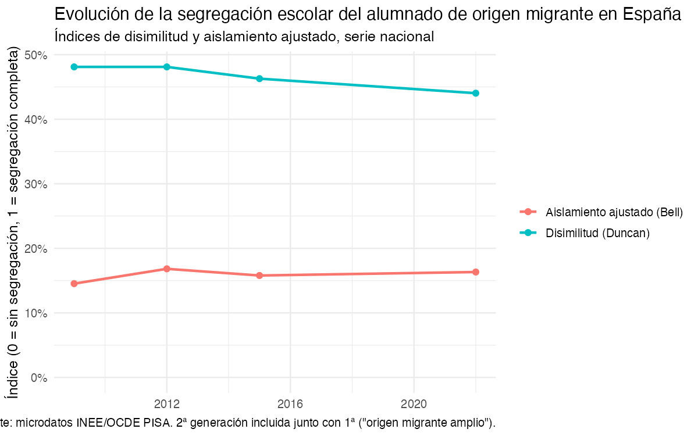
```

El resultado es, a primera vista, contraintuitivo: mientras el peso
migrante sube con claridad, el índice de disimilitud se mantiene
prácticamente plano o incluso baja ligeramente
(**`r scales::percent(seg_first$dissim_index, accuracy = 0.1)`** en
`r first_year` frente a **`r scales::percent(seg_last$dissim_index, accuracy = 0.1)`**
en `r last_year`), y el aislamiento ajustado se mueve en una banda estrecha
sin tendencia definida. Es decir: el alumnado migrante no está cada vez
más desigualmente repartido *entre colegios en general* -- lo que sí es
estable y robusto en toda la serie es la sobrerrepresentación en la
pública frente a la privada, que se analiza a continuación. Conviene
matizar así cualquier narrativa de "cada vez más segregados": el
mecanismo que sostiene la evidencia es la titularidad del centro, no una
fragmentación creciente del sistema escolar en su conjunto.

### 1.2 Segregación por comunidad autónoma

```{r}
#| label: tbl-segregacion-ccaa
#| echo: false
#| tbl-cap: !expr paste("Segregación por CCAA,", last_year)
seg_ccaa |>
  filter(year == last_year, !is.na(dissim_index)) |>
  arrange(desc(dissim_index)) |>
  select(ccaa, n_colegios, pct_migrante, dissim_index, isolation_adj) |>
  gt() |>
  fmt_percent(columns = c(pct_migrante, dissim_index, isolation_adj), decimals = 1) |>
  fmt_number(columns = n_colegios, decimals = 0) |>
  cols_label(
    ccaa = "CCAA", n_colegios = "Colegios", pct_migrante = "% migrante",
    dissim_index = "Disimilitud", isolation_adj = "Aislamiento ajustado"
  )
```

La variación territorial es sustancial (ver tabla), y es precisamente el
valor añadido de este proyecto frente al internacional: una cifra nacional
plana esconde comunidades con segregación alta y estable, y otras con
segregación baja pero al alza -- se ve mejor en la serie completa de abajo.

### 1.3 Evolución de la segregación por CCAA

```{r}
#| label: fig-segregacion-ccaa-trend
#| echo: false
#| fig-cap: "Evolución de los índices de segregación escolar por CCAA, 2009-2022"
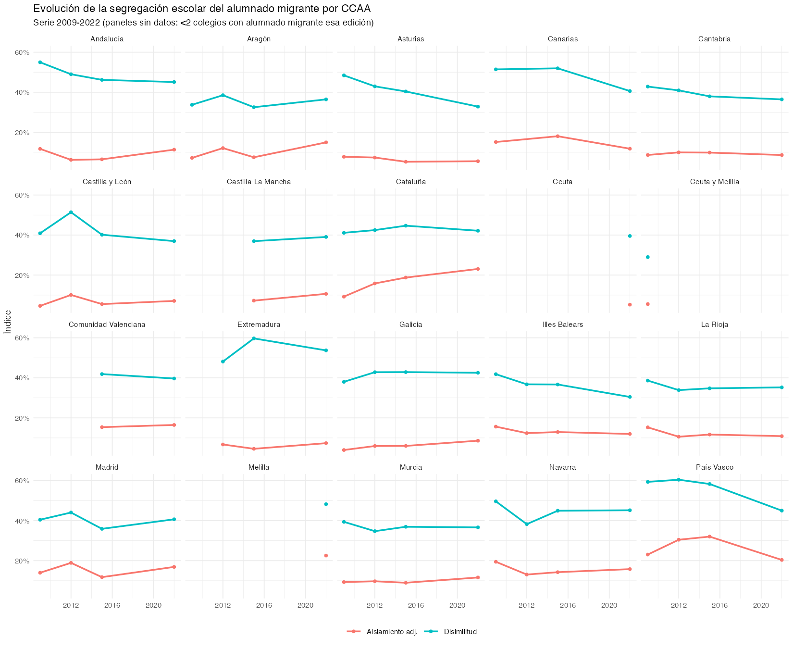
```

Con la serie completa por CCAA se ve lo que la tabla nacional no puede
mostrar: la disimilitud baja con claridad en algunas comunidades (Asturias,
Canarias, País Vasco) pero sube en otras (Aragón, Castilla-La Mancha,
Cataluña) -- la lectura nacional "plana" es, en parte, la suma de
tendencias territoriales opuestas que se cancelan. El aislamiento ajustado
es más estable dentro de cada CCAA que entre CCAA: hay comunidades que
parten de un nivel bajo y se quedan ahí, y otras (Cataluña, País Vasco) con
aislamiento estructuralmente más alto en las cuatro ediciones. Algunos
paneles quedan vacíos o con un único punto -- son ediciones con menos de 2
colegios con alumnado migrante en esa CCAA, donde el índice no es estable
(ver aviso en `R/05_segregacion_heterogeneidad.R`); es también el motivo de
que "Ceuta y Melilla" (código conjunto de 2009) y "Ceuta"/"Melilla" (2022,
ya separados) aparezcan como tres paneles distintos en vez de uno.

### 1.4 Brecha de escolarización pública/privada

```{r}
#| label: tbl-brecha-pubpriv
#| echo: false
#| tbl-cap: "Brecha migrante-nativo en % escolarizado en centro público"
pubpriv_gap |>
  select(year, pct_en_publico_nativo, pct_en_publico_migrante, brecha, ci_low, ci_high, pct_cobertura_pubpriv) |>
  gt() |>
  fmt_percent(
    columns = c(pct_en_publico_nativo, pct_en_publico_migrante, brecha, ci_low, ci_high, pct_cobertura_pubpriv),
    decimals = 1
  ) |>
  cols_label(
    year = "Año", pct_en_publico_nativo = "% nativo en pública",
    pct_en_publico_migrante = "% migrante en pública", brecha = "Brecha (p.p.)",
    ci_low = "IC95% inf.", ci_high = "IC95% sup.", pct_cobertura_pubpriv = "Cobertura dato"
  )
```

```{r}
#| label: fig-brecha-pubpriv
#| echo: false
#| fig-cap: "Brecha de escolarización pública/privada, migrante vs. nativo"
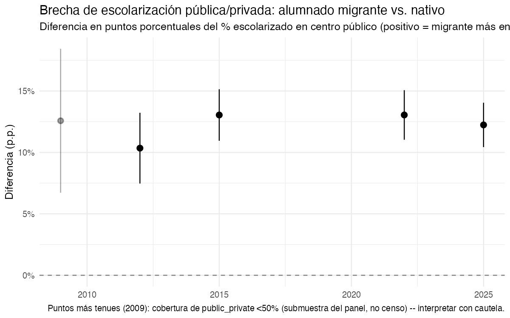
```

A diferencia de los índices de disimilitud/aislamiento, esta brecha sí es
grande, estable y significativa en las cuatro ediciones: el alumnado
migrante está entre
**`r scales::percent(pubpriv_last$ci_low, accuracy = 0.1)`** y
**`r scales::percent(pubpriv_last$ci_high, accuracy = 0.1)`** puntos más
presente en la pública que el nativo en `r last_year`
(brecha puntual: **`r scales::percent(pubpriv_last$brecha, accuracy = 0.1)`**),
en línea con `r first_year`
(**`r scales::percent(pubpriv_first$brecha, accuracy = 0.1)`**, IC95%
`r scales::percent(pubpriv_first$ci_low, accuracy = 0.1)`--`r scales::percent(pubpriv_first$ci_high, accuracy = 0.1)`).
El dato de `r first_year` procede de una submuestra parcial (cobertura
`r scales::percent(pubpriv_first$pct_cobertura_pubpriv, accuracy = 0.1)`,
ver `R/01c_incorporate_public_private_historic.R`) y debe leerse con más
cautela que el resto, aunque apunta en la misma dirección.

### 1.5 Puntuación por origen migrante (univariante)

Todo lo anterior mira cómo se reparte el alumnado migrante entre colegios;
esto mira directamente su puntuación, sin ajustar por nada -- nativo, 1ª
generación y 2ª generación por separado (a diferencia del resto del
capítulo, que los agrupa como "origen migrante amplio" para calcular
segregación). Es el paso previo, descriptivo, al modelo ajustado de la
sección 3.

```{r}
#| label: fig-distribucion-migracion
#| echo: false
#| fig-cap: !expr paste("Distribución de puntuación por origen migrante,", last_year)
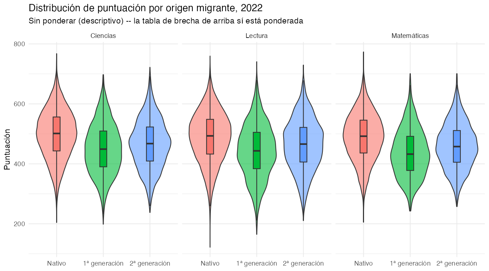
```

```{r}
#| label: fig-brecha-migracion
#| echo: false
#| fig-cap: "Brecha de puntuación por origen migrante (referencia: nativo), serie 2009-2022"
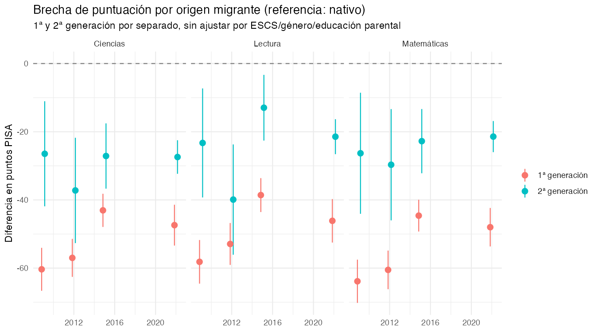
```

La brecha es grande en las cuatro ediciones y en los tres dominios, y con
un patrón muy consistente: la 1ª generación (alumnado nacido fuera de
España) puntúa muy por debajo del nativo -- en `r last_year` y matemáticas,
**`r round(brecha_migracion_last$brecha_1gen[brecha_migracion_last$domain=="math"], 0)`
puntos** menos (IC95%
`r round(brecha_migracion_last$ci_low_1gen[brecha_migracion_last$domain=="math"], 0)` a
`r round(brecha_migracion_last$ci_high_1gen[brecha_migracion_last$domain=="math"], 0)`) --
mientras que la 2ª generación (nacida en España, de familia migrante) tiene
una brecha bastante menor,
**`r round(brecha_migracion_last$brecha_2gen[brecha_migracion_last$domain=="math"], 0)`
puntos** (IC95%
`r round(brecha_migracion_last$ci_low_2gen[brecha_migracion_last$domain=="math"], 0)` a
`r round(brecha_migracion_last$ci_high_2gen[brecha_migracion_last$domain=="math"], 0)`),
sistemáticamente la mitad o menos de la de 1ª generación en los tres
dominios y las cuatro ediciones. Es el patrón de "convergencia
generacional" habitual en la literatura de migración -- y un matiz
importante para la pregunta de investigación: agregar 1ª y 2ª generación en
un único "origen migrante" (como hace el resto del capítulo, por necesidad
para el índice de segregación) esconde que se trata de dos poblaciones con
una brecha de resultado muy distinta. Nótese también que la brecha de 1ª
generación es netamente más estrecha en `r last_year` que en `r first_year`
en los tres dominios (aunque no de forma monótona -- repunta algo entre
2015 y `r last_year`), pese a que el peso migrante ha subido en todo ese
periodo (sección 1.1) -- otro dato que no encaja con una narrativa simple
de "más migración, peor resultado".

### 1.6 Evolución de la puntuación por CCAA, y su relación con la segregación

```{r}
#| label: fig-puntuacion-ccaa-trend
#| echo: false
#| fig-cap: "Evolución de la puntuación PISA por CCAA (media de los 3 dominios), 2009-2022"
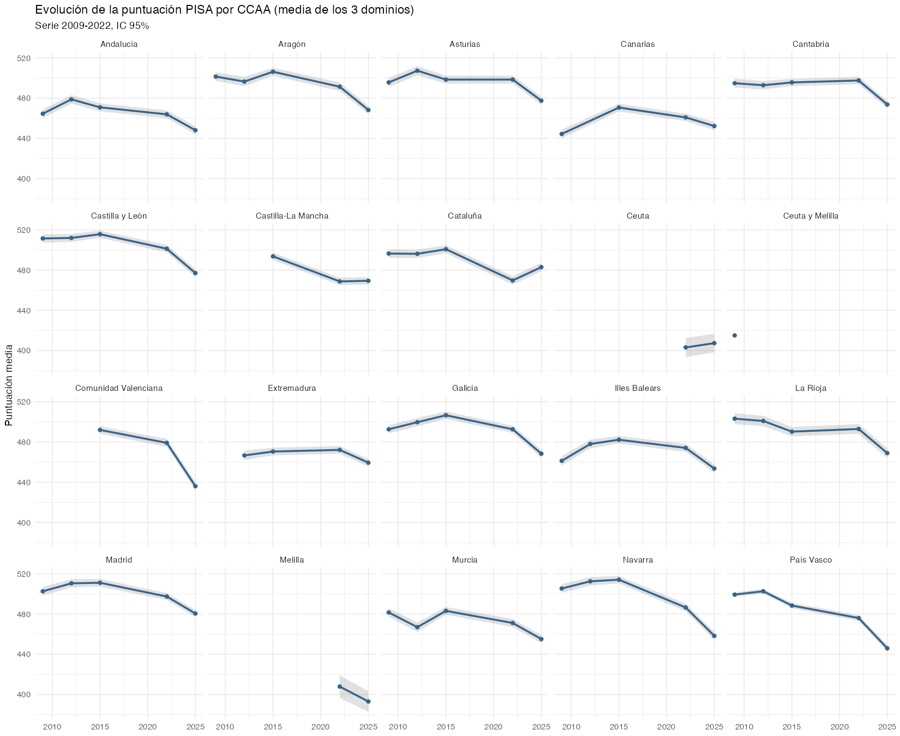
```

Como con la segregación, la caída nacional agregada esconde trayectorias
muy distintas por CCAA: País Vasco es la única con un declive sostenido
edición tras edición desde 2012; Cataluña y Navarra suben o se mantienen
hasta 2015 y caen de golpe en la última edición (el patrón más parecido a
"la caída de 2022" que motivó esta pregunta); Canarias e Illes Balears, en
cambio, suben en toda la serie. ¿Coinciden las CCAA que más han
subido en segregación con las que más han caído en puntuación? Es la
pregunta natural dado todo lo anterior -- la respuesta, con la cautela que
exige mirarla con solo 17 comunidades:

```{r}
#| label: fig-correlacion-cambio-ccaa
#| echo: false
#| fig-cap: "Cambio en segregación (disimilitud) vs. cambio en puntuación, por CCAA"
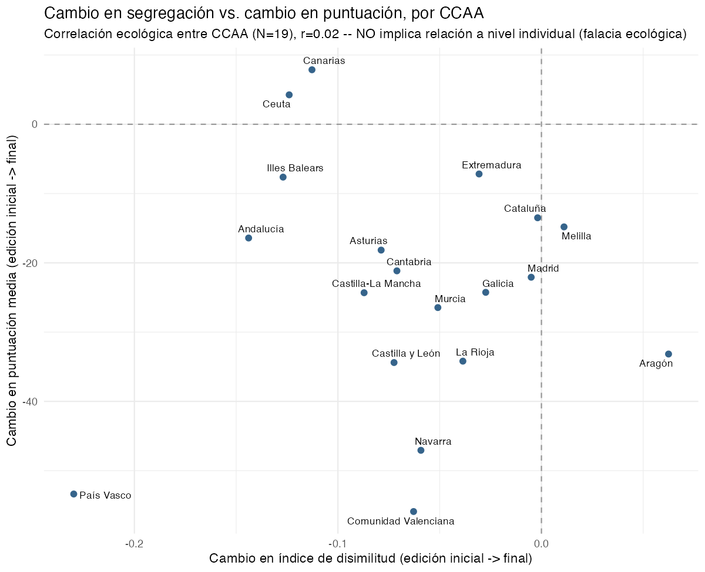
```

La correlación es débil y **no significativa**: r =
`r round(cor_ccaa$estimate, 2)` (IC95%
`r round(cor_ccaa$conf.int[1], 2)` a `r round(cor_ccaa$conf.int[2], 2)`,
p = `r round(cor_ccaa$p.value, 2)`, N = `r nrow(cambio_ccaa)` CCAA). El
signo apunta en la dirección esperada por H1 (más aumento de disimilitud,
más caída de puntuación), pero el intervalo es tan ancho que cruza
ampliamente el cero, y hay contraejemplos claros a simple vista -- el caso
más llamativo es País Vasco, con una de las mayores **caídas** de
disimilitud (menos segregación) y a la vez una de las mayores caídas de
puntuación, justo lo contrario de lo que predeciría H1. Con solo 17 puntos
no hay potencia estadística para zanjar nada aquí; esto es una foto de
conjunto, no una prueba, y **es una correlación ecológica**: un patrón (o
su ausencia) entre promedios de CCAA no implica ni descarta ninguna
relación a nivel de alumno individual.

## 2. Distractores digitales en el aula

### 2.1 Serie histórica del proxy de exposición (2009-2022)

```{r}
#| label: tbl-exposicion-nacional
#| echo: false
#| tbl-cap: "Proxy de exposición a pantallas/redes sociales (escala 0-4)"
exp_nacional |>
  select(year, media, ci_low, ci_high, n) |>
  gt() |>
  fmt_number(columns = c(media, ci_low, ci_high), decimals = 2) |>
  fmt_number(columns = n, decimals = 0) |>
  cols_label(year = "Año", media = "Media", ci_low = "IC95% inf.", ci_high = "IC95% sup.", n = "N")
```

```{r}
#| label: fig-exposicion-trend
#| echo: false
#| fig-cap: "Proxy de exposición a pantallas/redes sociales, serie nacional"
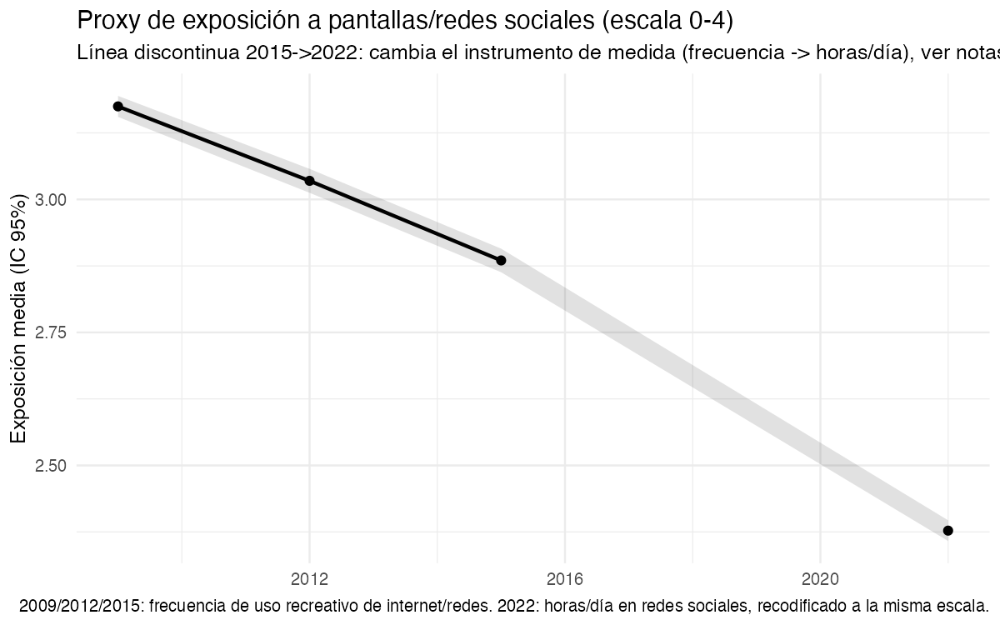
```

**Aviso metodológico, imprescindible para no sobre-interpretar esta
serie**: no existe un ítem comparable de "distracción/uso de pantallas" en
las cuatro ediciones. `r first_year`-2015 miden *frecuencia* de uso
recreativo de internet/redes (nunca -> varias veces al día); `r last_year`
mide *horas al día* en redes sociales, un constructo distinto (para esa
edición casi todo el alumnado ya usa redes a diario, así que la pregunta
relevante pasó de "si" a "cuánto"). Los dos se recodifican aquí a la misma
escala 0-4 solo para poder dibujarlos en una serie, pero el salto entre
2015 y `r last_year` (línea discontinua en el gráfico) mezcla un cambio de
instrumento con cualquier cambio real de comportamiento -- la caída
aparente de `r scales::percent(exp_first$media/4, accuracy=1)` a
`r scales::percent(exp_last$media/4, accuracy=1)` (sobre la escala 0-4) casi
seguro **no** significa que el alumnado use hoy menos pantallas que en
`r first_year`; es más plausible que sea, al menos en parte, un artefacto
de instrumento. Esta serie es contexto/tendencia, no la evidencia que
responde a la pregunta de investigación -- para eso está la sección 2.2.

### 2.2 Asociación transversal 2022: distracción en clase y puntuación

Aquí sí hay un ítem "fuerte" y específico, nuevo en 2022, sin equivalente
en ediciones anteriores: con qué frecuencia el alumnado se distrae en
clase por su propio dispositivo, o por el de sus compañeros. Se modela
`score_z ~ distracción + ESCS + género + educación parental`, por
dominio, con errores estándar robustos agrupados por colegio (sandwich
CR1) para no subestimar la incertidumbre por el diseño en clusters.

```{r}
#| label: tbl-asociacion-distraccion
#| echo: false
#| tbl-cap: "Distracción en clase y puntuación PISA 2022 (dif. en DE vs. \"nunca/casi nunca\")"
asociacion_22 |>
  filter(predictor_var %in% c("distr_propia", "distr_pares")) |>
  mutate(
    categoria = sub("^distr_(propia|pares)", "", term),
    predictor_lab = recode(predictor_var,
      distr_propia = "Dispositivo propio",
      distr_pares  = "Dispositivo de compañeros"
    ),
    domain_lab = recode(domain, math = "Matemáticas", read = "Lectura", science = "Ciencias"),
    valor = sprintf("%.2f (%.2f, %.2f)", estimate, ci_low, ci_high)
  ) |>
  select(predictor_lab, categoria, domain_lab, valor) |>
  pivot_wider(names_from = domain_lab, values_from = valor) |>
  arrange(predictor_lab, categoria) |>
  gt(groupname_col = "predictor_lab") |>
  cols_label(categoria = "Frecuencia declarada")
```

```{r}
#| label: fig-asociacion-distraccion
#| echo: false
#| fig-cap: "Distracción en clase y puntuación PISA 2022, por dominio"
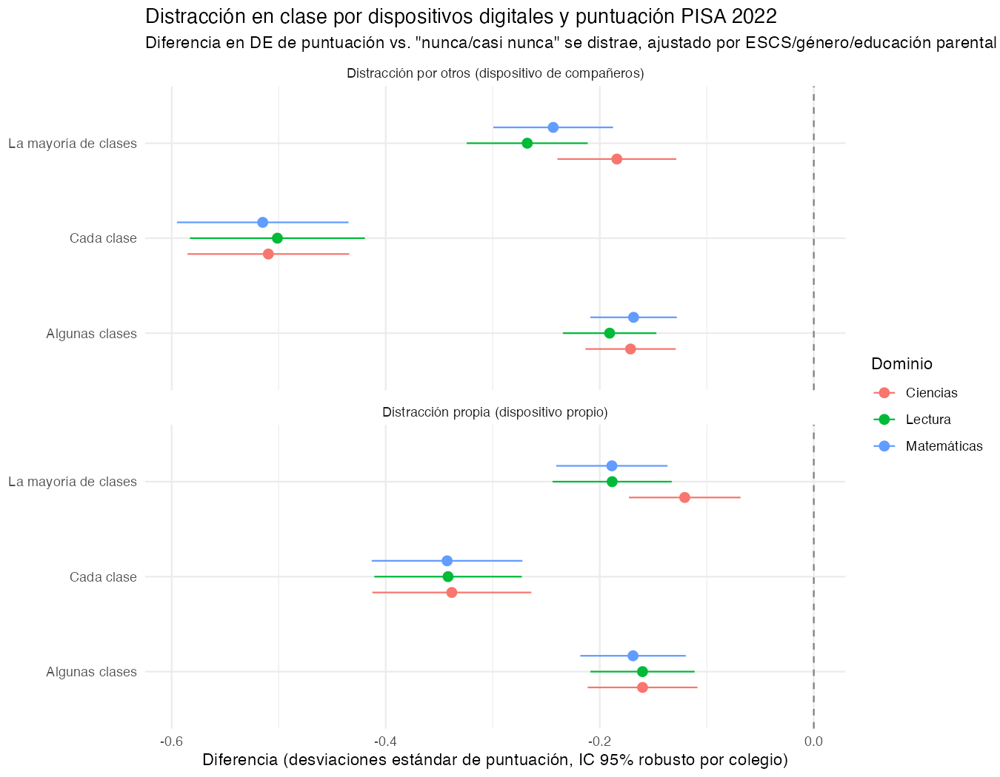
```

```{r}
#| label: horas-redes-inline
#| echo: false
rango_por_categoria <- function(pred, cat_regex) {
  asociacion_22 |>
    filter(predictor_var == pred, grepl(cat_regex, term)) |>
    summarise(lo = min(estimate), hi = max(estimate))
}
propia_cada_clase <- rango_por_categoria("distr_propia", "Cada clase$")
pares_cada_clase  <- rango_por_categoria("distr_pares", "Cada clase$")
horas_redes_rango <- asociacion_22 |>
  filter(predictor_var == "horas_redes") |>
  summarise(lo = min(estimate), hi = max(estimate))
fmt_rango <- function(r) sprintf("%.2f y %.2f", abs(r$hi), abs(r$lo))
```

Los tres resultados son consistentes, estadísticamente robustos (más de
960 colegios como unidad de agrupación en todos los modelos) y van todos
en la misma dirección. Distraerse "cada clase" por el propio dispositivo
se asocia con entre `r fmt_rango(propia_cada_clase)` DE menos de
puntuación según el dominio, frente a "nunca/casi nunca"; distraerse por
el dispositivo de **compañeros** "cada clase" tiene una asociación
todavía mayor, entre `r fmt_rango(pares_cada_clase)` DE -- es decir, el
entorno de clase (lo que hacen los demás) pesa al menos tanto como el
propio uso. La intensidad de uso de redes sociales (horas/día, 2022)
muestra un gradiente más moderado pero también significativo: entre
`r fmt_rango(horas_redes_rango)` DE por cada categoría de horas adicional,
en los tres dominios.

```{r}
#| label: tbl-asociacion-distraccion-puntos
#| echo: false
#| tbl-cap: "Misma asociación, en puntos PISA (DE traducida con la escala de cada modelo)"
asociacion_22 |>
  filter(predictor_var %in% c("distr_propia", "distr_pares")) |>
  mutate(
    categoria = sub("^distr_(propia|pares)", "", term),
    predictor_lab = recode(predictor_var,
      distr_propia = "Dispositivo propio", distr_pares  = "Dispositivo de compañeros"
    ),
    domain_lab = recode(domain, math = "Matemáticas", read = "Lectura", science = "Ciencias"),
    valor = sprintf("%.0f (%.0f, %.0f)", estimate_puntos, ci_low_puntos, ci_high_puntos)
  ) |>
  select(predictor_lab, categoria, domain_lab, valor) |>
  pivot_wider(names_from = domain_lab, values_from = valor) |>
  arrange(predictor_lab, categoria) |>
  gt(groupname_col = "predictor_lab") |>
  cols_label(categoria = "Frecuencia declarada")
```

En puntos (que es lo que de verdad se compara con la caída de la última
edición en el debate público): distraerse "cada clase" por el propio
dispositivo se asocia con unos 27-29 puntos menos, y por el dispositivo de
un compañero, unos 41-42 puntos menos -- para referencia, una DE bruta de
puntuación en 2022 son unos
`r round(escala_puntos$de_puntos[escala_puntos$year==last_year & escala_puntos$domain=="math"], 0)`
puntos en matemáticas (tabla de escala completa al final del capítulo), así
que estos efectos son grandes: entre un tercio y la mitad de una DE.

```{r}
#| label: fig-distribucion-distraccion
#| echo: false
#| fig-cap: "Distribución de puntuación PISA 2022 por distracción propia en clase"
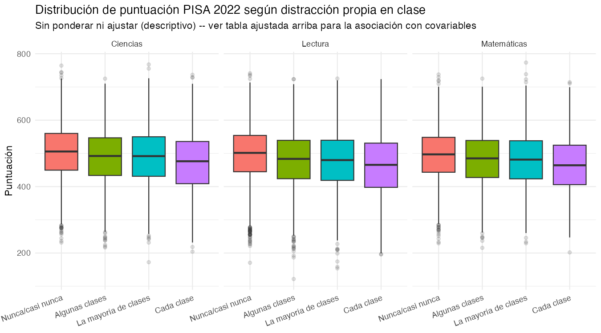
```

## 3. Modelo mixto: ¿cuánto explican de la varianza entre colegios?

Las dos secciones anteriores examinan H1 y H2 por separado, cada una con
su propio modelo. Esta sección los integra en un único modelo mixto, con
la concentración migrante del colegio y la distracción agregada del
colegio como covariables de **nivel colegio**, e interacción con el
origen migrante individual, para valorar cuánta VARIANZA ENTRE COLEGIOS
(VPC) explican. Se limita a `r last_year`: la distracción agregada no
existe en ediciones anteriores (sección 2.1), así que no tiene sentido una
serie temporal aquí. Se ajustan cinco modelos anidados, por dominio (no un
efecto trivariante como en `qmd/04-resultados.qmd` -- aquí la pregunta es
otra, y se opta deliberadamente por el análisis separado por resultado):

```{r}
#| label: setup-modelo9
#| echo: false
modelo_lab_levels <- c("M0: nulo", "M1: +individual", "M2: +% migrante colegio", "M3: +distracción colegio", "M4: +interacción")
vpc_escuela_cov <- vpc_escuela_cov |>
  mutate(modelo_lab = recode(modelo,
    M0_nulo = "M0: nulo", M1_individual = "M1: +individual",
    M2_segregacion = "M2: +% migrante colegio", M3_distraccion = "M3: +distracción colegio",
    M4_interaccion = "M4: +interacción"
  ) |> factor(levels = modelo_lab_levels))
vpc_m0_math <- vpc_escuela_cov |> filter(domain == "math", modelo == "M0_nulo")
vpc_m1_math <- vpc_escuela_cov |> filter(domain == "math", modelo == "M1_individual")
vpc_m2_math <- vpc_escuela_cov |> filter(domain == "math", modelo == "M2_segregacion")
vpc_m3_math <- vpc_escuela_cov |> filter(domain == "math", modelo == "M3_distraccion")
```

- **M0 (nulo)**: solo colegio y CCAA como aleatorios, sin covariables.
- **M1 (+individual)**: + género, educación parental, ESCS (cuartil),
  origen migrante, público/privado.
- **M2 (+% migrante del colegio)**: + concentración de alumnado migrante
  del propio colegio (centrada).
- **M3 (+distracción del colegio)**: + medias del colegio de distracción
  propia/por compañeros (centradas).
- **M4 (+interacción)**: + origen migrante individual × % migrante del
  colegio.

```{r}
#| label: tbl-vpc-escuela
#| echo: false
#| tbl-cap: "VPC de colegio por dominio y modelo anidado"
vpc_escuela_cov |>
  select(domain, modelo_lab, n, vpc_mean, vpc_lower, vpc_upper) |>
  mutate(domain = recode(domain, math = "Matemáticas", read = "Lectura", science = "Ciencias")) |>
  arrange(domain, modelo_lab) |>
  gt(groupname_col = "domain") |>
  fmt_percent(columns = c(vpc_mean, vpc_lower, vpc_upper), decimals = 1) |>
  fmt_number(columns = n, decimals = 0) |>
  cols_label(modelo_lab = "Modelo", n = "N", vpc_mean = "VPC colegio", vpc_lower = "IC95% inf.", vpc_upper = "IC95% sup.")
```

```{r}
#| label: fig-vpc-escuela
#| echo: false
#| fig-cap: "VPC de colegio (2022) según qué covariables se van añadiendo, por dominio"
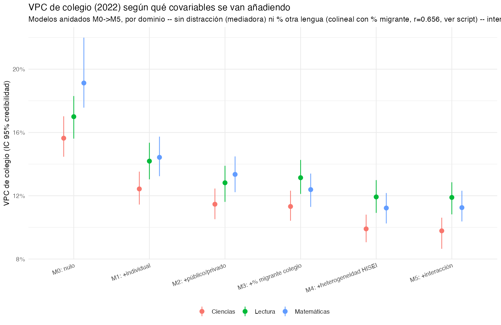
```

La lectura, en matemáticas como referencia (los otros dos dominios se
mueven igual): el modelo nulo reparte
**`r scales::percent(vpc_m0_math$vpc_mean, accuracy=0.1)`** de la varianza
total entre colegios. Añadir las covariables individuales (M1) es, con
diferencia, lo que más baja esa cifra --
**`r scales::percent(vpc_m1_math$vpc_mean, accuracy=0.1)`** --, esperable,
porque ESCS/origen migrante/tipo de colegio están fuertemente agrupados
por colegio. Añadir DESPUÉS la concentración migrante del propio colegio
(M2) apenas mueve la aguja --
**`r scales::percent(vpc_m2_math$vpc_mean, accuracy=0.1)`**, un cambio casi
nulo respecto a M1--: **una vez se sabe quién es cada alumno (su propio
origen, su ESCS, si su colegio es público o privado), saber además cuán
concentrado en migrantes está su colegio añade poco.** Es un resultado que
matiza más todavía la hipótesis de segregación de la sección 1: ni
siquiera en un modelo que aísla el efecto de la composición del colegio
aparece como un explicador fuerte de la varianza entre colegios. Añadir la
distracción agregada del colegio (M3) sí baja algo más la cifra en los
tres dominios -- un paso proporcionalmente mayor que el de M2 --, aunque
parte de esa bajada se debe también a que M3 exige que el colegio tenga
dato de distracción (la muestra se reduce ligeramente). La interacción (M4) no
cambia apenas el VPC total -- pero sí importa por sí misma, y es la pieza
más interesante de este modelo:

```{r}
#| label: tbl-interaccion-migra
#| echo: false
#| tbl-cap: "Interacción origen migrante × % migrante del colegio (M4), en puntos PISA"
interaccion_migra |>
  mutate(
    domain_lab = recode(domain, math = "Matemáticas", read = "Lectura", science = "Ciencias"),
    generacion = if_else(grepl("primera_gen", term), "1ª generación", "2ª generación")
  ) |>
  select(domain_lab, generacion, estimate_puntos, ci_low_puntos, ci_high_puntos) |>
  gt(groupname_col = "domain_lab") |>
  fmt_number(columns = c(estimate_puntos, ci_low_puntos, ci_high_puntos), decimals = 1) |>
  cols_label(generacion = "Generación", estimate_puntos = "Puntos", ci_low_puntos = "IC95% inf.", ci_high_puntos = "IC95% sup.")
```

Esta interacción responde a una pregunta más precisa que la de M2: no "¿la
concentración migrante del colegio predice peor resultado en general?"
(apenas), sino "¿le va específicamente peor al alumnado migrante,
concretamente en los colegios más concentrados, por encima de su propio
origen y de la media del colegio?" -- y aquí la respuesta es que sí, en 5
de los 6 casos (generación × dominio) el intervalo de credibilidad no
cruza el cero, con penalizaciones adicionales que en ciencias llegan a
rondar los 30-36 puntos. Es el hallazgo más nítido de este modelo: la
concentración migrante del colegio no explica mucha varianza *en
promedio*, pero el alumnado migrante escolarizado en un colegio muy
concentrado sí sufre una penalización específica, más allá del efecto
medio del colegio y de su propio origen por separado. Como todo el
capítulo, es asociación transversal de `r last_year`, no causal: no se
puede descartar que colegios muy concentrados en migrantes compartan otras
características (recursos, rotación de profesorado, selección de
alumnado por parte de las familias) que expliquen parte de esta
interacción.

## 4. Síntesis

Los dos mecanismos propuestos no tienen el mismo grado de apoyo empírico
en estos datos, y el modelo conjunto de la sección 3 afina bastante el
cuadro respecto a mirar cada pieza por separado.

Sobre heterogeneidad y segregación (H1): la heterogeneidad migrante ha
aumentado con claridad (8,8 % a 13,2 % en 2009-2022) y la brecha de
escolarización migrante-nativo en la pública frente a la privada es
grande, estable y significativa en toda la serie (~10-13 p.p.). Pero eso
es prácticamente todo lo que sostiene H1: la concentración/segregación
*entre colegios en general* no crece (la disimilitud incluso baja
levemente), la correlación ecológica entre cambio en segregación y cambio
en puntuación por CCAA no es significativa (r = -0,28, p = 0,28, con
contraejemplos claros como País Vasco), y en el modelo mixto de la
sección 3 la concentración migrante del colegio apenas explica varianza
entre colegios una vez se controla por quién es cada alumno. El hallazgo
que sí sobrevive, y con fuerza, es más fino que "más segregación, peor
resultado": el alumnado migrante que está en colegios muy concentrados en
migrantes rinde específicamente peor que el que no lo está, por encima de
su propio origen y de la brecha media del colegio (interacción
significativa en 5 de 6 combinaciones dominio×generación). Es una
penalización de concentración real, pero dirigida al alumnado migrante,
no una fragmentación creciente de todo el sistema.

Sobre distractores digitales (H2): la asociación transversal de 2022 es
grande (10 a 42 puntos PISA según categoría y predictor, mayor cuanto más
frecuente la distracción declarada), consistente entre
los tres dominios y robusta a ajuste por ESCS/género/educación parental.
En el modelo mixto de la sección 3, la distracción agregada del colegio
también es la covariable de nivel colegio que más varianza entre colegios
explica de las dos consideradas -- más que la concentración migrante. Pero
sigue siendo una asociación de 2022 con 2022: no hay serie comparable de
distracción en clase para años anteriores que permita decir si este
mecanismo ha *aumentado* lo bastante como para explicar la caída, solo que
allí donde existe, se asocia con peor resultado -- y con más fuerza que la
concentración migrante del colegio.

En conjunto, si hay que apostar por un mecanismo entre los dos: los datos
apoyan más a la distracción digital (asociación fuerte, presente también a
nivel de colegio, aunque sin serie histórica) y a un efecto migrante muy
específico y localizado (concentración × origen individual) que a una
segregación escolar creciente en sentido amplio. Ninguna de las dos piezas
es, por sí sola, evidencia causal de la caída de 2025 -- son piezas
descriptivas y correlacionales que acotan qué hipótesis merece más peso en
el debate público, a la espera del microdato de esa edición.

## 5. Anexo: escala de puntos (DE -> puntos PISA)

Varias tablas de este capítulo expresan el efecto en desviaciones estándar
(DE) para poder comparar entre dominios/modelos; esta tabla da la
desviación típica real, en puntos, de cada dominio y edición, para poder
traducir cualquier "DE" del capítulo a una magnitud intuitiva. **No es una
constante única** -- cada modelo del capítulo usa la DE de su propia
muestra analítica (documentado en `R/07_migracion_puntuacion.R`), así que
esta tabla es una referencia general, no el valor exacto de cada
coeficiente (las tablas de puntos de las secciones 2.2 y 3 ya traen su
propia conversión incorporada).

```{r}
#| label: tbl-escala-puntos
#| echo: false
#| tbl-cap: "Media y desviación típica (ponderadas) de la puntuación PISA por dominio y año"
escala_puntos |>
  mutate(domain = recode(domain, math = "Matemáticas", read = "Lectura", science = "Ciencias")) |>
  gt(groupname_col = "domain") |>
  fmt_number(columns = c(media_puntos, de_puntos), decimals = 1) |>
  cols_label(year = "Año", media_puntos = "Media", de_puntos = "DE")
```
